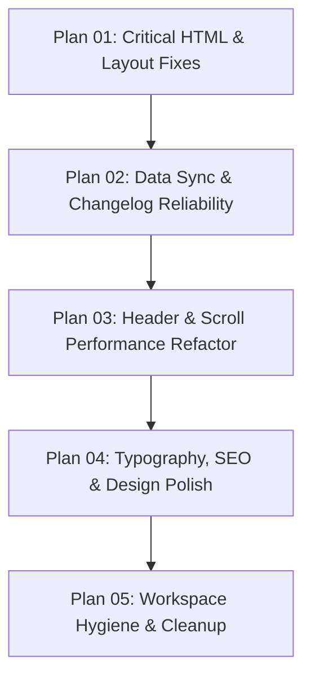

# Website Improvement & Bug Fix Master Plans

> **Workspace:** `blaqstudios.github.io`  
> **Created:** September 2026  
> **Status:** Ready for Execution  

This directory contains modular, highly focused execution plans for auditing, repairing, and optimizing the Blaq Studios website. Each plan is decoupled by **severity**, **domain**, and **modification risk**, allowing individual tasks to be executed and verified independently without cross-component distraction.

---

## Plan Directory & Execution Matrix

| Plan File | Scope / Focus | Severity | Risk Level | Target Files |
| :--- | :--- | :---: | :---: | :--- |
| **[01-critical-html-and-layout-fixes.md](file:///d:/Blaq%20Studios/Website/blaqstudios.github.io/.agents_plans/01-critical-html-and-layout-fixes.md)** | Fix broken table markup, repair 2-column grid layout, resolve 404 links, and make headers visible on subpages. | **P0 (Critical)** | **Low** (Static HTML only) | `index.html` `games/flux-wall/index.html` `games/flux-wall/changelog.html` `games/shikaku/*.html` |
| **[02-data-sync-and-changelog-reliability.md](file:///d:/Blaq%20Studios/Website/blaqstudios.github.io/.agents_plans/02-data-sync-and-changelog-reliability.md)** | Fix HTTP 404 fetch path for version history and synchronize JSON dataset (1 release → 8 releases). | **P1 (High)** | **Low-Medium** (Data & fetch logic) | `scripts/changelog.js` `data/shikaku-versions.json` `data/shikaku-versions.js` |
| **[03-header-navigation-and-scroll-performance.md](file:///d:/Blaq%20Studios/Website/blaqstudios.github.io/.agents_plans/03-header-navigation-and-scroll-performance.md)** | Eliminate scroll jitter/jumping, prevent DOM particle thrashing, and stabilize floating header state transitions. | **P1 (High)** | **High** (Shared CSS & JS across all pages) | `styles/base.css` `scripts/main.js` |
| **[04-typography-seo-and-design-consistency.md](file:///d:/Blaq%20Studios/Website/blaqstudios.github.io/.agents_plans/04-typography-seo-and-design-consistency.md)** | Add missing Google brand fonts (`Fredoka`/`Inter`) to subpages, add missing SEO/OG tags, and harden asset paths. | **P2 (Medium)** | **Low** (Additive `<head>` tags) | `games/shikaku/*.html` `games/flux-wall/*.html` |
| **[05-workspace-hygiene-and-repository-cleanup.md](file:///d:/Blaq%20Studios/Website/blaqstudios.github.io/.agents_plans/05-workspace-hygiene-and-repository-cleanup.md)** | Remove obsolete draft files (`index.html.new`, raw `.md` drafts) and upgrade repository documentation. | **P3 (Low)** | **Very Low** (Housekeeping) | `games/flux-wall/*` `README.md` |

---

## Recommended Execution Flow

1. **Phase 1 (Immediate UX Repair):** Execute `01-critical-html-and-layout-fixes.md` first. This restores broken public page structures without touching CSS or JavaScript logic.
2. **Phase 2 (Data Integrity):** Execute `02-data-sync-and-changelog-reliability.md` to ensure the release history API and local fallbacks display all 8 versions seamlessly.
3. **Phase 3 (Core Performance & Navigation):** Execute `03-header-navigation-and-scroll-performance.md`. Modify `base.css` and `main.js` with dedicated cross-browser testing of scroll behaviors.
4. **Phase 4 (Brand & Search Optimization):** Execute `04-typography-seo-and-design-consistency.md` to eliminate system-font fallbacks on legal/history pages and add search engine tags.
5. **Phase 5 (Housekeeping):** Execute `05-workspace-hygiene-and-repository-cleanup.md` to remove legacy artifacts and finalize documentation.
