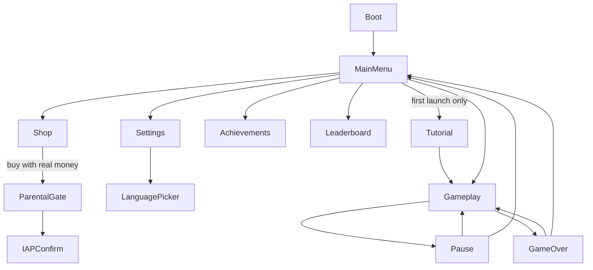

# FLUX WALL — Game & Technical Design Bible
### Godot 4.7 Production Build · Source of Truth v2.4

**Status:** Living Design Bible · **Date:** 2026-09-12 · **Owner:** Game Design/Tech Lead
**Target engine:** Godot 4.7 (stable) · **Platform:** Android — the sole build and publishing target for this document (no Web/HTML5 export, no iOS build — see the note below)
**Ad network:** Google AdMob (Android) · **Genre:** One-tap endless arcade dodger

> **How to use this document.** This document is **fully self-contained.** There is no reference build, no external prototype, and no prior codebase — Flux Wall is a new project. Every mechanic, number, color, and asset described here is the *complete and only* specification. Anyone or anything implementing this game — including an AI coding assistant working section by section — should not need, and should not assume the existence of, any source outside this file. If a detail isn't written down here, treat it as undecided and flag it, rather than inferring it from somewhere else.
>
> Every number, hex code, and string in here is a *default*, not a law — but it is the default everyone (and every model) should build against unless a section is explicitly revised and the changelog at the end is bumped. Section numbers are stable going forward from this v2.0 revision; new content should be added as new sub-sections or new top-level sections at the end, not by renumbering.

> **Assumptions made explicit up front** (proceeding with sensible defaults rather than blocking on them — flag in review if any is wrong):
> - **Android (API 26+ / Android 8+) is the sole build and publishing target** — portrait-only, phones + tablets.
> - Reference canvas **720×1280** for every coordinate, size, and layout value in this document (§4.1).
> - This game is being built with AI-assisted development (an AI coding assistant implementing directly against this document). §21's roadmap is therefore ordered by **dependency, not calendar time** — no duration estimates are given, and a working first version covering the core loop through basic monetization is realistically achievable in a single focused day of AI-assisted work, not weeks.
> - Android is the **only** platform this document builds for. The IAP plugin choice (§12.1) happens to also support iOS, which is mentioned once as a side note, not a roadmap commitment — there is no iOS build, no Web/HTML5 export, and no section of this document should be read as targeting either.
> - Monetization model: free-to-play, ads (**Google AdMob**) + IAP, no gambling-style randomized-reward mechanics (§9.5).
> - Premium currency is called **Gems** everywhere in code, save data, and UI — chosen once here so it's never ambiguous.

> **Four non-negotiable integrity/design rules** (cut across many sections — every implementer must satisfy all four):
> 1. **Save data is local-only** (no cloud/account sync in v1) — `user://` JSON file, §14.3.
> 2. **A rewarded ad grants its reward if and only if** the ad SDK's *earned-reward* callback fires. Ad-not-available, ad-failed-to-show, and user-closed-early must **never** grant a reward — §11.4.
> 3. **An IAP grants its entitlement if and only if** Google Play reports the purchase in the `PURCHASED` state — never `PENDING`, never cancelled, never assumed from a local flag alone — §12.4.
> 4. **No engagement mechanic in this game may punish absence or gate core play behind a depleting resource** (no energy/lives system, no guilt-based streak-loss messaging). Retention is earned by making the game worth returning to, not by penalizing players for leaving — §10.1 explains why, and it governs everything else in §10.
> 5. **Loss of internet connectivity never revokes a previously-granted entitlement and never blocks core gameplay.** Offline, ads and purchases simply become unavailable until connectivity returns — the game is always fully playable offline, and a device being offline is never grounds for the game to *take back* something a player already owns — §11.5 and §12.7.

---

## Table of Contents
1. Game Overview & Vision
2. Visual Identity & Theme System
3. Art & Asset Specification (generation-ready)
4. Gameplay World Layout
5. Difficulty Curve Design
6. Economy — Coins & Gems
7. Shop Catalog
8. Achievements
9. Reward Systems
10. Player Retention & Engagement
11. Advertising — Google AdMob
12. In-App Purchases
13. UI/UX Design
14. Scene Architecture, Navigation & Transitions
15. Performance, Memory & Optimization
16. Threading Strategy
17. Localization — 10 Languages
18. Animation & Audio Design
19. Tutorial / Onboarding
20. Full Text & Button Inventory
21. Production Roadmap & QA
Appendix — Glossary, Palette Reference, Changelog

---

## 1. Game Overview & Vision

### 1.1 Pitch
*One thumb. One tap. A shaft that never stops falling away beneath you, and every 25 points the rules of physics themselves flux — gravity flips heavy, floors turn to ice, the world inverts. Flux Wall is an endless reflex arcade game where the only thing that stays constant is that dying is always your fault, never the game's.*

### 1.2 Core mechanic
The ball sits in a vertical **shaft** bounded by a **left wall** and a **right wall**. Gravity pulls it down continuously — it never stops falling on its own. A tap fires a **hop**: a fixed impulse that's part upward, part sideways, sending the ball on a parabolic arc toward one of the two walls. Direction strictly alternates with every tap — tap 1 goes left, tap 2 goes right, tap 3 goes left, and so on for the rest of the run. The player never chooses a direction, only *when* to commit to the next hop.

> **The alternation rule is now confirmed.** An earlier revision of this document flagged a mismatch between a stated rule and its worked example in an earlier brief and implemented strict alternation as the best reading. A later brief settled it explicitly: a tap "reverses the player's horizontal direction" — i.e., every tap flips it, full stop. **Strict alternation (L, R, L, R…) is correct and final** — nothing in §4–§5 needs to change on this point.

Each wall has a continuous track running its length, made of **safe segments** and **obstacle segments** — obstacles are still called **spikes**, now built into the wall's face as protrusions rather than floating free in open space (§3.4). When the ball's arc carries it into contact with a wall, whichever segment it lands on decides the outcome: landing on a safe segment scores a point; landing on an obstacle ends the run. Both wall tracks scroll downward continuously, and gravity and hop velocity both scale up as score rises (every 5 points, capped by score 400, §5.2) — together these are what set the pace of the whole game and demand progressively faster reactions, while the safe-zone size the ball has to land in shrinks along its own separate, equally-capped track.

> **The complete rules, stated plainly (nothing about win/score/death exists outside this list):**
> - Touch a **safe** segment of either wall → **+1 score**, ball physically reflects off the wall into open space, wait for the next tap.
> - Touch an **obstacle** segment of either wall → **run ends**.
> - Touch the **top or bottom kill-line boundaries** (`y ≤ -40` or `y ≥ 1320`) → **run ends**, regardless of walls or obstacles.
> There is no fourth outcome and no time limit — a run only ends by one of the two conditions above.

The top/bottom kill-lines exist because the ball's hop is a two-axis impulse: tap too early, over and over, before each arc finishes, and the ball nets upward height every time and eventually reaches the ceiling; wait too long between taps and gravity alone carries it to the floor. Placed just outside the visible 720×1280 canvas (`y = -40` top, `y = 1320` bottom; 1360px playable span), they catch out-of-bounds trajectory while keeping the entire visible screen playable. Unlike obstacle placement, this failure mode is never procedurally generated — it's a pure function of the player's own timing, which is exactly why it's fair by construction (§5.1 covers why obstacle placement additionally needs an explicit invariant, and why this doesn't).

The player's visual sprite is deliberately larger than its actual collision hitbox — a generous, forgiving margin baked into every hit-test in the game, because "fair" is a design pillar, not an afterthought (§1.3, §5.1).

Every 25 points, the run advances to the next of **9 named themes** (§2), each changing the palette *and* a physics modifier *and* introduces a themed pickup. This rotating "flux" is the game's actual identity and the source of its name.

### 1.3 Design pillars
1. **Always fair.** Every failure must be legible in hindsight as a player mistake, never as an unavoidable configuration. This is a hard, testable rule (§5.1's fairness invariant), not an aspiration.
2. **Instantly readable.** At a glance: where am I, which wall am I about to land on, is that landing zone clear. No UI element competes with the one thing that matters — the wall coming up.
3. **The flux *is* the hook.** The 9-theme physics-shifting system is the differentiator versus every other "tap to dodge" game on the store — protect and polish it, don't bury it under generic content.
4. **Juice without noise.** Every hit, landing, and pickup gets a visible + audible response (§18), but nothing so loud it masks the read on the wall coming up.
5. **Earn attention, don't trap it.** Monetization and retention design (§9–§12) never touch difficulty, speed, or hitboxes, and never punish a player for putting the game down — see integrity rule #4 above.

### 1.4 Target platforms & engine notes
Android 8+ (API 26+), portrait lock, 60fps target on mid-tier devices from the last ~4 years, built in Godot 4.7. Two Godot 4.7-specific features are used directly in this spec: **offset transforms for Control nodes** (lets UI elements animate — squash, nudge, pop — without breaking their parent container's layout, used throughout §18 for button/HUD juice) and **Tweens that can await signals** (cleans up chained-animation sequencing code, also §18).

### 1.5 Reference resolution
All coordinates, sizes, and layout values in this document are given at a **720×1280** reference canvas (portrait, 9:16). Godot project setting: `Window → Stretch → Mode: canvas_items`, `Aspect: expand`. Safe area: reserve **64px** top and **56px** bottom (and **16px** side margins) on every screen, regardless of physical device, for notches/status bars and gesture-navigation bars respectively — every layout in §13 already bakes this in.

---

## 2. Visual Identity & Theme System

### 2.1 Two layers, two rules
Flux Wall's visuals are deliberately split into two layers with two different rules:
- **Gameplay themes (9 of them, §2.2):** these rotate constantly — that rotation *is* the game's hook, not a limitation to work around.
- **Chrome (§2.3):** the menu/shop/settings/HUD-frame identity. This layer is **fixed and never flux** — a player needs one stable visual "home" to return to between runs, or the brand has no consistent silhouette.

### 2.2 The 9 gameplay themes
Every 25 points, the run advances to the next theme in this list (wrapping back to #1 after #8; #9 is a separate unlock, not part of the automatic cycle — see below):

| # | Theme | Background | Wall | Player | Spike | Physics modifier | Themed pickup |
|---|---|---|---|---|---|---|---|
| 1 | Neon | `#1A1A1A` | `#AAAAAA` | `#00FFFF` | `#FF0055` | Normal | Score multiplier |
| 2 | Magma | `#220000` | `#FF4400` | `#FFAA00` | `#FF0000` | Heavy gravity (×1.5) | Coolant (temporarily cancels the heavy-gravity modifier) |
| 3 | Toxic | `#001100` | `#00FF00` | `#CCFF00` | `#FF00FF` | Bouncy (after a safe landing, the ball rebounds farther back into open space with leftover velocity instead of settling gently — the next hop's direction still follows strict alternation, but the ball is already moving when it fires) | Antidote |
| 4 | Ice | `#001133` | `#00FFFF` | `#FFFFFF` | `#FF4500` | Slippery (on landing, the ball slides briefly along the wall's face before settling, so its exact rest position is a little less predictable than normal) | Grip |
| 5 | Void | `#000000` | `#555555` | `#AAAAAA` | `#FFFFFF`, always with a `#FFFFFF` @ 50% 2px rim light regardless of the darkness modifier | Darkness (reduced ambient visibility) — **fairness floor: spike opacity never drops below 70% and the rim-light is never disabled, no matter how dark the ambient look gets** | Flare (temporary full visibility) |
| 6 | Solar | `#222200` | `#FFFF00` | `#FFFFEE` | `#FFAA00` | Super speed (+20% world speed for the theme's duration) | Time Warp (temporary speed reduction) |
| 7 | Vapor | `#2D002D` | `#FF00FF` | `#00FFFF` | `#FF00CC` | Low gravity (×0.6) | Anchor (temporarily restores normal gravity for players who prefer it) |
| 8 | Inverted | `#EEEEEE` | `#222222` | `#000000` | `#FF0000` | Chaos (patterns switch every 3–4s instead of 5–8s) | Shield |
| 9 | **Prism** *(mastery unlock, not part of the automatic cycle)* | Animated diagonal gradient cycling all 8 hues over 4s | `#FFFFFF`, rim-lit to show the gradient through a Fresnel-style edge | `#FFFFFF` core with an animated rainbow rim | `#FFFFFF` core with an animated rainbow rim | Normal — a "victory lap" tier, never a harder one on top of everything else | Score multiplier |

**Background note:** Theme 8 (Inverted) uses a light background — its glow/bloom treatment switches to a soft drop-shadow post-effect instead of additive bloom for that theme specifically, since additive glow reads poorly against a light backdrop (§3 has the exact asset-level note).

### 2.3 Chrome — the fixed identity
**Dark Tech / Circuit** is the one constant visual language for every menu, shop, settings screen, and HUD frame, regardless of which of the 9 gameplay themes is currently active behind it.

| Token | Hex | Usage |
|---|---|---|
| `color/bg_base` | `#0B0E1A` | Root background behind all chrome screens |
| `color/bg_panel` | `#171B36` @ 92% opacity | Cards, modals, list rows |
| `color/border` | `#2E3568` | 2px hairline borders on cards/inputs |
| `color/accent_primary` | `#00E5FF` | Primary buttons, active tab, selected state |
| `color/accent_danger` | `#FF3D7A` | Destructive actions, error text |
| `color/coin_gold` | `#FFD34D` | Coin icon + coin counter text |
| `color/gem_teal` | `#38E1C6` (gradient to `#8B5CF6`) | Gem icon + gem counter text |
| `color/text_primary` | `#F5F7FF` | Headlines, button labels |
| `color/text_secondary` | `#9AA3C7` | Descriptions, timestamps, locked-state labels |
| `color/success` | `#4DF0A0` | Purchase confirmed, achievement unlocked |
| `color/locked` | `#4A5080` @ 60% opacity overlay | Locked shop items/achievements |

### 2.4 Typography
- **Display / score / logo:** `Orbitron` (Bold 700) — a futuristic, geometric display face. **Constraint:** covers basic Latin only (no Cyrillic, CJK, or Devanagari). Use it **only** for numeric score/level counters and the "FLUX WALL" logotype — content that never needs translation.
- **UI body / buttons / all translatable text:** `Inter` (Regular 400 / SemiBold 600 / Bold 700) — full Latin Extended + Cyrillic coverage.
- **CJK fallback:** `Noto Sans JP`, `Noto Sans KR`. **Devanagari fallback:** `Noto Sans Devanagari`. All wired as fallback fonts on the same `FontVariation` used for body text (§17.2 has the exact Godot setup). All four families are open-license (SIL OFL / Apache), free to bundle.

---

## 3. Art & Asset Specification (generation-ready)
Every visual asset in this section is written as a **complete, standalone brief** an image-generation AI can work from directly — no other section needs to be cross-referenced to generate a given asset. Consistency across the ~45 separate assets in this game is achieved by having every one of them inherit the same master style below, rather than by hoping each independently-written description happens to agree.

### 3.1 Master style (prefix this to every asset generation request in this section)
> Flat 2D vector game icon/sprite. Solid flat color fill — no photographic texture, no realistic material rendering (no metal, glass, fabric, or skin shading), at most one soft linear or radial gradient where a specific asset explicitly calls for one. A thin (3px at this canvas's scale) semi-transparent white (`#FFFFFF` @ 40% opacity) rim-light stroke traces only the silhouette's upper-left-facing edges, implying one consistent light source from the upper left. A soft additive outer glow (~12px blur radius) in the shape's own fill color at ~50% opacity surrounds the whole silhouette. Background: fully transparent. Composition: subject centered, ~10% padding on all sides within the canvas. Edges: clean vector anti-aliasing, no jagged pixels. **Explicitly avoid:** photorealism, 3D rendering, hand-painted texture/brushwork, heavy black cartoon outlines or sticker-style borders, drop shadows, background scenery, watermarks, or any text unless a specific asset card says otherwise.

### 3.2 Tinted vs. fixed-color assets — read this before generating anything below
Two different generation rules apply, marked per-asset:
- **[Tinted]** — generate as a **pure white (`#FFFFFF`) fill** on a transparent background (the rim-light and glow layers are also generated in white). The game engine applies the correct color at runtime via a shader/modulate tint, because these shapes must display in whichever of the 9 theme colors (§2.2) is currently active. **Do not bake a specific color into a [Tinted] asset** — generating nine separate colored copies of the same shape is both unnecessary and will drift inconsistently across separate generation calls.
- **[Fixed]** — generate with the **exact hex color(s) given, baked directly into the image**, because this asset keeps one identity color regardless of which theme is active (currency, power-ups, chrome/UI icons all fall in this category, since they need to stay recognizable no matter what's happening in the background).

### 3.3 Player skins — all [Tinted] unless noted
| Asset ID | Shape / subject | Size | Notes |
|---|---|---|---|
| `player_default` | Perfect circle | 58×58px | The base free skin. Collision hitbox is a separate, smaller circle (radius 26px) handled in code, not part of the image. |
| `player_circuit` | Circle with a faint circuit-trace line pattern etched into the fill (subtractive — thin transparent lines cut through the solid fill, not overlaid on top) | 58×58px | |
| `player_triangle` | Equilateral triangle, point facing upward (up = the direction of travel against gravity) | 58×58px | |
| `player_hex` | Regular hexagon | 58×58px | |
| `player_gold` | Circle | 58×58px | **[Fixed]** — gradient fill `#FFD700` (top) to `#B8860B` (bottom), a single bright diagonal highlight streak, no theme tinting — this skin keeps its gold identity in every theme. |
| `player_void` | Circle | 58×58px | **[Fixed]** — matte fill `#0A0A0A`, visible only through its rim-light and glow (both still rendered, in `#FFFFFF`) — deliberately the most minimal, "hardcore" cosmetic in the game. |
| `player_prism` | Circle | 58×58px | **[Fixed, animated]** — white core fill `#FFFFFF`, with an animated rainbow rim-light (rotating hue cycle instead of a static white rim) cycling all 8 base theme hues over ~4 seconds. Generate as a 6–8 frame sprite sheet if the pipeline requires pre-baked frames, or as a single white base sprite plus a separate rotating-hue shader if generated procedurally. |

### 3.4 Spike (obstacle) skins — all [Tinted]
**Positioning note:** spikes are built into each wall's inner face as protrusions along its scrolling obstacle track (§4.5) — not free-floating in the open shaft. The shapes/sizes below are unchanged by this; only their attachment point changes (anchored flush against the wall surface, pointing inward toward the shaft).

| Asset ID | Shape / subject | Size | Notes |
|---|---|---|---|
| `spike_default` | Isosceles triangle, point facing the direction the player approaches from | 45×45px | Base hazard. |
| `spike_saw` | Same triangle silhouette as `spike_default`, with 6 small notches cut into the back (non-pointed) edge | 48×48px | Deliberately the *same base silhouette* as Default — its personality comes from the notches and an in-engine rotation animation (0.4 rev/sec), not from a different shape, so its danger-reading stays instantly recognizable at a glance. |
| `spike_x` | Two overlapping triangles forming a 4-pointed star/X | 50×50px | |
| `spike_crystal` | Same triangle base silhouette, with 2 internal facet lines suggesting a cut-gem surface | 50×50px | |
| *(all spike assets)* | — | — | 2px `#FFFFFF` @ 45% rim-light on the leading edge only (the edge facing the player) — a deliberate, consistent readability cue: that edge always marks "this is the dangerous side," regardless of skin. |

### 3.5 Trail particle textures — small, single-particle source images (the engine instances many copies per trail)
| Asset ID | Shape | Size | Color |
|---|---|---|---|
| `trail_dust` | Soft-edged circle | 8×8px | **[Tinted]** white base, low emission density in-engine |
| `trail_fire` | Flame-lick teardrop shape | 12×12px | **[Fixed]** gradient `#FF6A00` to `#FFD54D`, medium density |
| `trail_matrix` | Thin vertical rounded-rectangle streak | 6×18px | **[Fixed]** `#00FF00`, high density, falls straight down behind the player regardless of travel direction (deliberate "digital rain" nod to the game's name) |
| `trail_starlight` | 4-point sparkle/star | 10×10px | **[Fixed]** `#FFFFFF`, sparse density |
| `trail_aurora` | Soft-edged ribbon segment | 10×20px | **[Fixed]** gradient `#38E1C6` to `#8B5CF6`, medium density |

### 3.6 Currency icons — both [Fixed]
**Naming note:** this game's premium currency is called **Gems** throughout code, save data, and UI (§6.1) — functionally and visually the same thing some briefs call "Diamonds." One name, chosen once, used everywhere.

| Asset ID | Shape | Size | Color |
|---|---|---|---|
| `icon_coin` | Flat circle | 48×48px | `#FFD34D` fill, `#C98A1D` 3px rim ring — reads as "yellow coin" at a glance |
| `icon_gem` | Flat hexagon/elongated-diamond-cut silhouette | 48×48px | Gradient `#4D9FFF` (top, blue) to `#8B5CF6` (bottom, violet), one 45°-angled highlight facet at `#FFFFFF` @ 50% opacity — reads as "blue gem/diamond" at a glance |

### 3.6.1 Floating Orbs — the theme-specific instant-modifier pickups
One orb design per theme's pickup (§2.2's "themed pickup" column — Coolant, Antidote, Grip, Flare, Time Warp, Anchor; the remaining two, Score multiplier and Shield, reuse the coin/`powerup_shield` art rather than a unique orb). All [Tinted]:

| Asset ID | Shape | Size | Notes |
|---|---|---|---|
| `orb_base` | Sphere with a soft inner swirl (a single curved highlight arc, not a full texture) | 52×52px | The one shared silhouette for every themed orb — only the runtime tint and a small icon glyph in its center change per theme, so six orbs never need six separate generation passes. |
| Center glyph per theme | Snowflake (Coolant) / droplet-cross (Antidote) / tire-tread chevron (Grip) / flame (Flare) / clock (Time Warp) / anchor (Anchor) | ~20×20px, centered inside `orb_base` | Small enough to read as a glyph, not a competing shape — the orb's silhouette stays dominant |

### 3.7 Power-up icons — all [Fixed] (must read clearly against any of the 9 themes, so they never tint)
**Two families, same visual treatment, different behavior (§4.6):** `powerup_shield`, `powerup_nuke`, and `powerup_magnet` are **stockpiled abilities** — they only ever appear in the shop and the bottom HUD ability bar (§13), never as a floating pickup in the shaft. `powerup_slowmo` and `powerup_doublescore` are **auto-trigger floating pickups**, appearing in the shaft like coins and orbs.

| Asset ID | Shape | Size | Color |
|---|---|---|---|
| `powerup_shield` | Hexagonal shield outline | 54×54px | `#4DF0FF` |
| `powerup_nuke` | Radiating 8-point burst/star | 54×54px | `#FF6A3D` |
| `powerup_magnet` | Horseshoe magnet with two rounded pole-tips | 54×54px | `#FFB020` |
| `powerup_slowmo` | Hourglass | 54×54px | `#B98BFF` |
| `powerup_doublescore` | Double chevron (>>) | 54×54px | `#4DF0A0` |

### 3.8 Chrome UI icons — all [Fixed], `#00E5FF` (the chrome accent color, §2.3), simple filled-icon style, 72×72px canvas unless noted
| Asset ID | Subject |
|---|---|
| `ui_icon_settings` | Gear/cog |
| `ui_icon_back` | Left-pointing chevron |
| `ui_icon_pause` | Two vertical bars |
| `ui_icon_play_small` | Right-pointing triangle (for buttons where "Play" needs an icon alongside text) |
| `ui_icon_trophy` | Trophy silhouette (Achievements) |
| `ui_icon_shop` | Shopping bag |
| `ui_icon_gift` | Gift box with a ribbon (Daily Reward) |
| `ui_icon_globe` | Globe with longitude/latitude lines (Language) |
| `ui_icon_speaker_on` | Speaker with sound waves |
| `ui_icon_speaker_off` | Speaker with an X or slash |
| `ui_icon_restore` | Circular refresh/restore arrow |
| `ui_icon_leaderboard` | 3-bar ranking podium |
| `ui_icon_quest` | Checklist/clipboard with a checkmark |
| `ui_icon_bell` | Notification bell |
| `ui_icon_wifi_off` *(new, offline indicator — §11.5/§12.7)* | Wi-Fi signal icon with a slash through it |

### 3.9 Backgrounds & textures
| Asset ID | Description | Size | Notes |
|---|---|---|---|
| `bg_grid_tile` | A single tileable grid-line square: thin lines forming one grid cell | 96×96px | **[Fixed]** `#FFFFFF` @ 8–10% opacity on transparent — the engine repeats/tiles this across the full playfield and scrolls it for cheap parallax depth (§4.3). The 9 theme backgrounds themselves (§2.2) are otherwise flat engine-native color fills — they don't need separate generated background images. |
| `bg_shop_card` | Soft radial glow vignette on a dark circuit-trace pattern, no specific subject | 512×512px | **[Fixed]** base `#0B0E1A`, trace lines `#00E5FF` @ 12% opacity — sits behind each item preview on the Shop screen (§13). |

### 3.10 App icon
| Asset ID | Description | Size | Notes |
|---|---|---|---|
| `app_icon_master` | The `player_default` orb shape, Neon-theme colored (`#00FFFF` fill per §2.2 theme 1), centered on a solid `#0B0E1A` background, no wall/spike elements, no text | 1024×1024px | **[Fixed].** Icons must read at 48px on a home screen — a lone glowing circle reads at any size; a busier scene does not. Platform-specific rounded/squircle masking is applied automatically by the store tooling, not baked into this master. |

### 3.11 Achievement tier frames — all [Fixed]
| Asset ID | Shape | Size | Color |
|---|---|---|---|
| `frame_bronze` | Hexagonal outline/border shape | 130×130px | `#B08D57` |
| `frame_silver` | Hexagonal outline/border shape | 130×130px | `#C7CCD8` |
| `frame_gold` | Hexagonal outline/border shape | 130×130px | `#FFD34D` |
| `frame_platinum` | Hexagonal outline/border shape | 130×130px | Gradient `#38E1C6` to `#8B5CF6` |

### 3.12 Gameplay particle FX (small source sprites the particle system instances many of)
| Asset ID | Shape | Size | Notes |
|---|---|---|---|
| `fx_pass_spark` | Small filled square | 6×6px | **[Tinted]** — burst of 10 on every successful safe wall landing (§4.3) |
| `fx_death_shard` | Small irregular angular shard/triangle fragment | 4–8px (varies) | **[Tinted]**, mixed with plain white copies — burst of 16 on collision |
| `fx_chest_sparkle` | 4-point sparkle | 10×10px | **[Fixed]** `#FFD34D`, plays on milestone-chest reveal (§9.3) |

---

## 4. Gameplay World Layout — position of every in-game element

### 4.1 Coordinate system
Reference canvas **720×1280**, origin top-left, Y increases downward (Godot 2D default). All positions below are absolute px at this reference; `canvas_items / expand` stretch mode (§1.5) scales to the actual device resolution.

### 4.2 The shaft
| Element | Position | Size |
|---|---|---|
| Left wall | `x: 0–20` (center x = 10) | 20px wide × full 1280px tall |
| Right wall | `x: 700–720` (center x = 710) | 20px wide × full 1280px tall |
| Playable shaft width | `x: 20–700` | 680px clear width |
| Background grid | fills full 720×1280, `z_index: -10` |

### 4.3 Walls, background, particles
| Element | Spec |
|---|---|
| Wall glow | 2px inner glow, using the wall's own theme color (§2.2) — never a different element's color |
| Background grid | Tiled `bg_grid_tile` (§3.9), scrolls at 0.3× the current obstacle-track scroll speed for cheap parallax depth |
| Landing-particle burst | 10 `fx_pass_spark` particles, player's current theme color, 400ms lifespan, additive blend, fired on every successful safe wall landing |
| Death-shatter burst | 16 `fx_death_shard` particles (mixed theme-color + plain white), 600ms lifespan, gravity + drag, fired on obstacle contact |

### 4.4 Player (the ball) — hop physics
| Property | Value |
|---|---|
| Visual diameter | 38.67px |
| Collision hitbox | Circle, radius **17.33px** — deliberately smaller than the visual sprite (≈65% of the visual area), a permanent fairness margin baked into every hit-test in the game |
| Gravity | **Base** 1400 px/s², continuous, never off — scales up with score per §5.2's speed axis, capped at 2240 px/s² by score 400 |
| Hop impulse — vertical | **Base** -666.67 px/s instantaneous vertical velocity, applied on every tap — scales with score alongside gravity (§5.2), capped at -1066.67 px/s |
| Hop impulse — horizontal | **Base** ±437.5 px/s instantaneous horizontal velocity, applied on every tap (+25% balance adjustment from 350 px/s) — sign set by the alternation state (§1.2), magnitude scales with score alongside gravity and vertical impulse (§5.2), capped at ±700.0 px/s. All three scale by the same multiplier together, so the arc's *shape* stays consistent even as its *speed* increases — a faster version of the same hop, never a differently-shaped one. |
| Alternation state | One stored value, `next_hop_direction`, flipped after every tap: `LEFT → RIGHT → LEFT → …`. **Every tap fully overrides whatever the ball is currently doing** — it doesn't add to existing velocity, it replaces it with a fresh impulse (at the *current* tier's scaled magnitude, §5.2) from the ball's current position. This is what makes rapid, impatient tapping risky (§4.4.1): each early tap re-launches from an already-elevated position, so repeated early taps compound upward. |
| Base hop duration | ≈1.55s to cross the full 680px shaft width at tier-0 constants (`680 / 437.5`) — shortens to ≈0.97s at the score-400 speed cap (`680 / 700`, §5.3). This is the "beat" of the game, and it visibly quickens as score climbs. |
| Peak arc height | ≈159px above the launch point at tier-0 (`666.67² / (2 × 1400)`) — grows to ≈254px at the speed cap, since a faster hop is also a taller one at this fixed multiplier relationship (§5.2). |
| Post-landing behavior & Wall Reflection | Safe wall impact triggers **physics-based vector reflection** (`WallReflection.gd`): specular reflection off the inward wall normal with normal restitution (baseline 0.85, scaled by theme elasticity such as Toxic) and tangential friction (baseline 0.08, modified by theme lateral drag like Ice). Minimum inward horizontal return velocity is enforced at `187.5 × k` px/s to prevent stalling. The ball is cleanly separated by a 1.33px offset beyond its collision radius, with an 0.08s debounce cooldown (`WALL_CONTACT_COOLDOWN`). Legacy `LANDING_REBOUND_DIST = 26.67px` is retained as a compatibility shim. An obstacle landing ends the run immediately — no reflection. |
| Vertical kill-lines | `y = -40` (top) and `y = 1320` (bottom), fixed in screen space outside the 720×1280 viewport (§4.4.1) — contact against either line (evaluated with player collision radius `r = 17.33px`: `position.y - r ≤ -40` or `position.y + r ≥ 1320`) ends the run immediately, independent of walls, shields, or invincibility. |
| Spawn position | `x = 360` (shaft center), `y = 640` at run start. The very first hop is a special case: it only has to cross the half-width (~340px) to reach the left wall, taking ≈0.78s, since the ball doesn't start already resting against a wall the way it does for every hop after. |
| Camera | **Fixed — does not follow the ball.** The 1360px band between the two kill-lines (`y = -40` to `y = 1320`) is a hard boundary the player manages through tap timing, fully framing the 720×1280 visible canvas. |

### 4.4.1 Why the top/bottom kill-lines are fair
From a centered spawn (`y = 640`), a single hop's peak (−159px) lands at `y ≈ 481` and a single hop's landing point at perfect timing is only ≈13px lower than where it started — well within the 720×1280 viewport and far from the kill-lines at `y = -40` and `y = 1320`. Reaching either line is only possible through **sustained** mistiming across multiple hops in a row: repeatedly tapping early climbs toward -40, repeatedly tapping late (or not at all) sinks toward 1320. A single mistimed tap is always recoverable; a boundary death is always the visible result of an established pattern, not a surprise — which is exactly what pillar 1 in §1.3 requires. Edge contact is evaluated against the ball's outer boundary (`r = 17.33px`). A subtle red vignette pulses at whichever edge the ball is within 67px of (`y < 27` or `y > 1253`), so the warning is visible well before the line is reached (§18.1).

**The shaft is conceptually infinite** — implemented as the obstacle tracks and background continuously scrolling past a fixed-position camera (§4.5), not as literal unbounded world geometry. The player-facing result is identical either way: gravity never stops pulling, so standing still relative to the scrolling world is equivalent to sinking toward the bottom kill-line, and the pressure to keep hopping is constant and permanent — there is no safe way to stop tapping.

### 4.5 Obstacle tracks (replaces a single shared "spike wave" with one independent track per wall)
Because direction is forced by strict alternation, the player never chooses which wall a given hop targets — which means fairness has to be guaranteed **on each wall's track independently** (§5.1), not as a single "somewhere across the width" guarantee. Each wall's track is a scrolling 1-dimensional sequence of safe and obstacle segments running down its length, generated in one of these rhythms (rotated periodically, no immediate repeats, same variety principle as before):

| Pattern | Description |
|---|---|
| STEADY | Evenly spaced obstacles, consistent safe-zone size — the default, always-available baseline |
| TUNNEL | Both walls simultaneously carry a long stretch of safe segments at matching heights — the one pattern that coordinates the two otherwise-independent tracks, giving a deliberate "breather" |
| LADDER | The safe zone's position steps progressively up or down across several consecutive segments on one wall, like rungs — rewards riding a readable drift instead of reacting fresh each time |
| CLUSTER | Obstacles bunched close together, followed by one longer clear stretch |
| TIGHT | Mostly obstacle, small precise safe windows — a challenge rhythm, only appears at higher tiers |

STEADY and CLUSTER are the only two available below score 100 (§5.6); TUNNEL, LADDER, and TIGHT unlock afterward. Each wall's track advances independently except during TUNNEL, which is the deliberate exception.

### 4.6 Pickups — three distinct kinds, three distinct behaviors
Everything collectible in a run falls into exactly one of three categories, and they behave differently on purpose:

| Kind | Examples | Trigger | Where it lives after collection |
|---|---|---|---|
| **Currency** | Coins, Gems | Auto-collect on contact, floats in open middle space | Added straight to the wallet (§6) |
| **Floating Orb** | Theme-specific instant modifiers (Coolant, Antidote, Grip, Flare, Time Warp, Anchor) | Auto-collect on contact, floats in open middle space, effect applies immediately | Nowhere — it's consumed the instant it's touched, no inventory involved |
| **Stockpiled ability** | Shield, Nuke, Magnet | **Never auto-triggers.** Earned via shop purchase (§7) or reward (§8–§10), added to a persistent count | Sits in the player's stockpile (§14.3.1) until manually activated from the bottom HUD (§13) — the player chooses the exact moment |

All three still spawn in the same open middle space the ball's arc passes through mid-hop, so collecting a Coin/Gem/Orb never requires deviating from a normal hop trajectory — but only Currency and Orbs are collected by simply touching them. Shield/Nuke/Magnet are bought or won, then **used on command**, which is what makes them a strategic reserve for a bad moment rather than a random windfall.

**Exactly what each does, stated once so it's never ambiguous:**
- **Shield** — the next obstacle contact within its duration is ignored instead of ending the run (one hit absorbed, not a timer — it's consumed by the save, not by a clock).
- **Nuke** — every obstacle currently on-screen is destroyed in a flash. This is a **survival and breathing-room tool, not a scoring tool**: clearing an obstacle this way never awards the safe-landing point (§6.2) that only a genuine hop-and-land sequence earns — otherwise a Gems-rich player could inflate score without executing the actual skill, which would undercut pillar 5 (§1.3) and the integrity of the leaderboard (§10.5).
- **Magnet** — pulls nearby Coins (not Gems, not Orbs) toward the player for a short duration, pure economy convenience with no survival effect.

---

## 5. Difficulty Curve Design

### 5.1 The fairness invariant (the single most important rule in this document)
Because the ball's direction is forced by strict alternation (§1.2), the player never gets to choose which wall a given hop targets — so fairness must be guaranteed **on each wall's track independently**, not as a single "somewhere across the width" guarantee.

> **Every wall's obstacle track must always have a safe segment of at least 86.67px (≈2.5× the ball's 34.67px hitbox diameter) reachable at its next scheduled contact point** — generous enough to absorb the small position variance Ice's slipperiness or Toxic's bigger rebound can introduce (§2.2). This is checked continuously, not just once at generation time: if a moving obstacle's oscillation (§5.6) would ever fully close that band, the update loop nudges its range or phase — never the difficulty tier, never the obstacle count — until the invariant holds again.

This single rule is the concrete, testable answer to "increasing difficulty, but never impossible."

### 5.2 Three independent difficulty axes, all pinned to the same score-400 plateau
Difficulty scales along three separate dials, each simple enough to reason about on its own, all capping out by score 400 so none of them can combine into something the §5.1 invariant can't keep fair:

**Axis 1 — Speed (gravity and hop velocity scale together, every 5 points):**
```
tier_step = floor(score / 5)                            # a new step every 5 points, as specified
k = 1 + min(0.60, tier_step × 0.0075)                    # physics multiplier, caps at 1.60× by score 400
current_gravity   = 1400 × k
current_hop_vy    = 666.67 × k
current_hop_vx    = 437.5 × k
obstacle_scroll   =  200 × k
```
Gravity and both hop-velocity components scale by the **same** multiplier `k`, which keeps the arc's shape (not just its speed) consistent as it gets faster — a bigger, slower-motion version of the same hop, not a differently-shaped one. Obstacle-track scroll speed scales by the same `k` too, so the whole game's pace — the ball's own physics *and* how fast new segments arrive — accelerates as one coordinated system instead of two dials that could drift out of sync.

**Axis 2 — Spatial precision (safe-zone size shrinks with score directly, independent of speed):**
```
effective_score = min(score, 400)
safe_zone_size = max(86.67, 173.33 - floor(effective_score / 15) * (2/3))     # px; floor pinned to the §5.1 invariant
```
**Axis 3 — Predictability (moving-obstacle chance, §5.6).**

Keeping these three separate (rather than one combined "difficulty" number) is deliberate: it means "faster" and "tighter" and "less predictable" are each tuned and capped on their own terms, and a QA pass can isolate exactly which axis needs adjusting if a tier feels wrong, rather than untangling one monolithic formula.

### 5.3 Tiered progression (aligned to the 25-point theme cycle, §2.2)
| Score range | Theme | Speed multiplier `k` | Gravity / Hop vy / Hop vx / Scroll | Safe-zone size | New element introduced |
|---|---|---|---|---|---|
| 0–24 | Neon | 1.00 → 1.04 | 1400 / 666.67 / 437.5 / 200 (px/s², px/s, px/s, px/s) | 173.33px | Tutorial pace; STEADY pattern only, every obstacle static (§5.6) |
| 25–49 | Magma (heavy gravity) | 1.04 → 1.08 | ~1456 / 693.33 / 455–472.5 / 208 | 160px | CLUSTER pattern unlocks, still all static |
| 50–99 | Toxic (bouncy) | 1.08 → 1.15 | ~1512 / 720.0 / 472.5–503 / 213 | 140px | Stockpiled abilities and Floating Orbs begin spawning, still all static |
| 100–199 | Ice (slippery) → Void (darkness) | 1.15 → 1.30 | ~1610 / 766.67 / 503–568.75 / 230 | 120–107px | **Moving obstacles begin (§5.6)**; TUNNEL and LADDER patterns unlock |
| 200–399 | Solar → Vapor → Inverted | 1.30 → 1.60 | ~1820 / 866.67 / 568.75–700 / 260 | 97–86.67px | TIGHT pattern unlocks; safe-zone size hits its floor by score 400 |
| 400+ | Full 8-theme loop repeats indefinitely | **plateaus at 1.60** | **2240 / 1066.67 / 700 / 320 — fixed for the rest of the run** | **plateaus at 86.67px** | No new mechanics — score keeps climbing via player skill/consistency alone |

Every value in this table is derived directly from the two formulas in §5.2 — there's no hidden per-row tuning, so any AI implementing this can compute the exact constants for any score without needing the table at all.

### 5.4 Why the plateau numbers hold up (the math behind "difficult but never impossible")
At the score-400 cap (`k = 1.60`), a full-width hop takes `680 / 700 ≈ 0.97s` — noticeably snappier than the untiered 1.55s, which is the "faster reaction times" the speed axis is explicitly meant to demand. At the capped scroll speed (320 px/s), a wall segment is visible for `1280 / 320 = 4.0s` before it reaches the contact line — *more* advance warning than the base tier had, not less, because scroll speed was retuned down slightly when it was unified with the speed axis in §5.2. The minimum safe zone (86.67px) stays roomier than the ball's hitbox by a fixed 52px margin (86.67 − 34.67) **at every tier, regardless of speed**, since the safe-zone floor is a spatial guarantee pinned to hitbox size, never a function of how fast the ball is moving. Speed makes the *timing* tighter; it never makes the *target* smaller than the invariant allows. "Difficult but never impossible" is true by construction at the cap, not just at the easier tiers.

### 5.5 Optional adaptive assist (soft, invisible, opt-outable)
If a player dies 3+ times within 10 seconds of run start, repeatedly across a session (a "stuck" signal, not one unlucky run), quietly hold all three §5.2 axes back for that session only: the speed multiplier `k` stops advancing, the safe-zone-size shrink pauses, and the moving-obstacle chance drops to 0%. Never communicated as "easy mode" — it's a retention safety net (§10), not a visible difficulty toggle.

### 5.6 Static-until-practiced, then moving
Below **score 100**, every obstacle on both walls is completely static — it only moves as part of the base downward scroll, nothing more. This dedicates a new player's first 100 points entirely to the one real skill this game teaches: reading an upcoming segment and timing a tap so the hop lands on it, with zero additional unpredictability layered on top.

At score 100 and beyond, each newly-generated obstacle independently rolls a chance to be a **moving** obstacle instead — and a mover animates along up to two independent axes at once:
- **Vertical:** slides along a fixed ±40px range on the wall's length, at a slow, constant 26.67px/s.
- **Horizontal:** extends and retracts its protrusion depth into the shaft by ±13.33px, at a slow, constant 10px/s — a spike that's normally a short nub can periodically reach farther into the ball's path.

Both axes use a full 6-second back-and-forth cycle, far slower than the ~0.6–1s a hop takes to resolve even at the score-400 speed cap, so a mover is always readable well before the player has to react to it. Because the roll happens per-obstacle, a given wave can land anywhere from all-static to all-moving purely by chance, rather than following a scripted forced ratio:

| Score range | Chance any given new obstacle is a mover |
|---|---|
| 0–99 | 0% — static only |
| 100–199 | 25% |
| 200–399 | 50% |
| 400+ | 70% (plateaus — deliberately never 100%, so a baseline of readable static obstacles always remains even at the hardest tier) |

The §5.1 fairness invariant is always checked against a mover's *worst-case* position on **both** axes simultaneously (maximum vertical excursion combined with maximum protrusion depth) — never its position at generation time or its current position — so a moving obstacle can make a wave harder to time well, but never technically unbeatable.

---

## 6. Economy — Coins & Gems

### 6.1 Currencies
**Coins** (soft currency, earned freely through play) and **Gems** (premium currency, earned slowly through play or purchased via IAP, §12).

### 6.2 Earn sources
| Source | Coins | Gems |
|---|---|---|
| Per safe wall landing | +1 | — |
| Perfect-landing bonus (within 15px of a safe zone's center) | +2 (total +3) | — |
| Coin pickup (in-run) | +5 to +15 (scales with tier) | — |
| Gem pickup (in-run, rare — 0.4% spawn chance per pickup slot) | — | +1 |
| Achievement rewards | varies, §8 | varies, §8 |
| Daily login (day 1–6) | 20–150 (escalating) | — |
| Daily login (day 7) | 200 | +25 |
| Daily quests (§10.3) | 30–100 per quest | 0–5 per quest |
| Rewarded ad: "Double Reward" at Game Over | doubles the run's coin/gem haul | doubles the run's coin/gem haul |
| Rewarded ad: Daily Bonus Chest | 50–150 | 0–3 |

### 6.3 Spend sinks
| Sink | Coins | Gems |
|---|---|---|
| Cosmetic skins (common tier) | 100–300 | — |
| Cosmetic skins (premium tier) | — | 50–150 |
| Trails | 100–300 | 50–100 |
| Continue/revive (2nd+ use per run — 1st is free, §9.1) | — | 25, scaling +15 per additional use in the same run |
| Gem → Coin exchange (convenience, sink-favoring rate) | receive 80 | costs 10 |

### 6.4 Balancing target
A player earning through pure free play should be able to afford roughly **one new common-tier cosmetic every 2–3 sessions** (assuming ~80–120 coins/session at mid-tier skill) and **one premium-tier item every 2–3 weeks** of daily play without spending, keeping the shop aspirational for spenders without feeling paywalled for non-spenders. Re-validate this ratio against real playtest telemetry once the game is live (§21).

---

## 7. Shop Catalog
| Category | Item | Price | Currency |
|---|---|---|---|
| Skins | Default | 0 | — (owned by default) |
| Skins | Circuit | 100 | Coins |
| Skins | Triangle | 150 | Coins |
| Skins | Hex | 150 | Coins |
| Skins | Gold | 500 | Gems |
| Skins | Void | 250 | Gems |
| Skins | Prism | — | Unlock via the "Legend" achievement (§8) or the Prism Bundle IAP (§12.2) |
| Spikes | Default | 0 | — |
| Spikes | Saw | 100 | Coins |
| Spikes | Crystal | 150 | Coins |
| Spikes | X-Factor | 100 | Gems |
| Trails | Dust | 0 | — |
| Trails | Fire | 200 | Coins |
| Trails | Starlight | 300 | Coins |
| Trails | Matrix | 100 | Gems |
| Trails | Aurora | 150 | Gems |
| Icon Frames | Bronze | 50 | Coins |
| Icon Frames | Silver | 150 | Coins |
| Icon Frames | Gold | 40 | Gems |
| Icon Frames | Platinum | 120 | Gems |
| Power-ups (stockpile charges — §4.6, activated from the HUD, §13) | Shield ×1 | 50 | Coins |
| Power-ups (stockpile charges) | Nuke ×1 | 75 | Coins |
| Power-ups (stockpile charges) | Magnet ×1 | 25 | Coins |
| Power-ups (auto-trigger floating pickups, not stockpiled) | Slow-Mo | 40 | Coins |
| Power-ups (auto-trigger floating pickups, not stockpiled) | Double Score | 60 | Coins |
| Bundles | Starter Bundle *(one-time, first 72h)* | $1.99 real money | — (§12.2) |

Pricing principle: Gems are reserved for genuinely premium/rare items (Gold skin, X-Factor spike, Matrix/Aurora trails, Gold/Platinum frames, Prism) so spending Gems always feels like a step up in rarity, never a same-tier reprice of a Coins item.

---

## 8. Achievements
| ID | Title | Condition | Reward |
|---|---|---|---|
| `score_20` | Novice | Score 20 | 50 Coins |
| `score_40` | Runner | Score 40 | 100 Coins |
| `score_100` | Pro | Score 100 | 200 Coins + 20 Gems |
| `score_250` | Veteran | Score 250 | 300 Coins + 40 Gems |
| `score_500` | Elite | Score 500 | 500 Coins + 80 Gems |
| `score_1000` | Legend | Score 1000 | 1000 Coins + 200 Gems + **Prism skin unlock** |
| `first_death` | Ouch! | Die once | 10 Coins |
| `deaths_100` | Glutton for Punishment | Die 100 times (lifetime) | 100 Coins |
| `coins_1000` | Treasure Hunter | 1000 lifetime Coins | 100 Coins + 20 Gems |
| `coins_10000` | Vault Keeper | 10,000 lifetime Coins | 500 Coins + 50 Gems |
| `perfect_10` | Threading the Needle | 10 dead-center safe-zone landings in one run | 30 Gems |
| `perfect_50` | Surgeon | 50 dead-center safe-zone landings (lifetime) | 100 Gems |
| `no_hit_streak_20` | Untouchable | Land 20 consecutive safe wall hits without touching an obstacle, in one run | 150 Coins |
| `themes_seen_8` | Full Spectrum | Experience all 8 base themes in one run (score ≥200) | 100 Gems |
| `skins_owned_5` | Collector | Own 5 different skins | 50 Gems |
| `power_used_50` | Gadgeteer | Activate a stockpiled ability (Shield/Nuke/Magnet) 50 times (lifetime) | 100 Coins |
| `daily_streak_7` | Regular | 7-day login streak | 200 Coins + 30 Gems |
| `daily_streak_30` | Devoted | 30-day login streak | 1000 Coins + 150 Gems |
| `revive_used_first` | Second Wind | Use a revive for the first time | 20 Coins |
| `theme_void_master` | Into the Dark | Score 50+ points within a single Void-theme segment | 80 Gems |
| `iap_first_purchase` | Patron | Complete any real-money purchase | 100 Gems (granted only after §12.4's verified-purchase flow confirms it — subject to the same integrity rule as every other grant) |

---

## 9. Reward Systems

### 9.1 Revive-on-death
- **First revive in a run: free**, offered automatically at Game Over as "Watch an ad to keep going?" (rewarded ad — §11.4's strict integrity contract governs this).
- **Second and subsequent revives in the same run:** cost Gems instead (25, +15 per additional use, §6.3), offered alongside the ad option so a player who's out of rewarded-ad fill can still pay to continue.
- **Hard cap:** no more than 4 revives per single run, regardless of payment method — protects the meaning of "score" as a fair, comparable number.
- Revive grants a fixed 1.5s invincibility grace window, then returns to full risk.

### 9.2 Daily login calendar
7-day cycle (resets to day 1 after day 7 is claimed): escalating Coins day 1→6, a Coins+Gems spike on day 7 (§6.2 has exact numbers). Missing a day does **not** harshly reset the streak counter — it pauses and resumes counting from where it left off, per integrity rule #4 (no punitive streak-anxiety design).

### 9.3 Milestone chest
Every 50 points within a single run, a chest icon appears in the HUD corner; collected automatically at Game Over, opened with a brief animation (`fx_chest_sparkle`, §3.12) revealing that run's total Coins/Gems haul.

### 9.4 Achievement completion
A toast slides in from the top the instant a condition is met — mid-run for run-based achievements, at Game Over for cumulative ones — with a "Claim" button that grants the reward via the single shared reward-issuing code path used everywhere in this game (§14.4).

### 9.5 Ethical & compliant monetization guidelines
Because this game may reach a broad, general audience, the following are hard requirements, not suggestions:
- **No randomized-reward-for-real-money mechanics** (no loot boxes, no gacha) — every shop item has a fixed, disclosed price in a fixed currency.
- **Parental gate before any IAP or external link** (§13.3), per standard Google Play guidance for apps that may be accessed by children.
- **AdMob's content-rating/child-directed tags** (`tagForChildDirectedTreatment`, `tagForUnderAgeOfConsent`) configured per §11 based on the app's actual store age rating.
- **No dark patterns:** no fake countdown pressure unless a timer is genuinely real, no pre-checked purchase confirmations, no ads disguised as gameplay UI.
- **Spend confirmation:** any Gems spend over 100, or any real-money IAP, shows an explicit confirmation dialog before completing.

---

## 10. Player Retention & Engagement
Retention is designed around **two different play patterns that must both be rewarded equally well**: long unbroken marathon sessions, and short 2–5 minute visits repeated across a day or week. Per integrity rule #4, nothing here is allowed to force either pattern — there is deliberately **no energy/lives system, no session cap, and no cooldown gate on core gameplay.** An endless arcade game whose whole appeal is "just one more run" is actively hurt by an artificial timer telling the player to stop; the systems below earn return visits through content and momentum instead.

### 10.1 Why no energy/lives system
A depleting-resource gate (common in many mobile genres) exists mainly to force a return visit, not to serve the player, and it directly contradicts this game's core loop — a player who wants to keep playing Flux Wall should always be able to. Every retention mechanic below works by giving the player something worth coming back *for*, never something they're locked out *of*.

### 10.2 Within-session retention ("just one more run")
| Mechanic | Design |
|---|---|
| Zero-friction restart | Tap Retry at Game Over → new run begins in under 0.3s, no loading screen, no interstitial *forced* before the very next attempt (interstitial placement rules, §11.3, only ever trigger between runs on a frequency cap, never immediately after every death) |
| Proximity-to-goal messaging | Game Over screen shows real, truthful progress toward the *next* concrete thing — "23 points from your next achievement," "3 points from your best" — always calculated from actual data, never a manufactured/fake number |
| Visible in-run momentum | Live streak counters (consecutive perfect passes, no-hit streak) stay on-screen during play so progress toward an in-flight achievement (§8) is always visible, not just revealed after the fact |
| Session milestone chest | Every 50 points, a chest appears in the HUD (§9.3) — a concrete, escalating reason to push one more theme-cycle further in a single sitting |

### 10.3 Daily quests (new short-form goal, refreshes every 24h)
Three rotating micro-goals, each achievable in a single short sitting (2–5 minutes for an average player), refreshing at a fixed daily rollover:
| Example quest | Reward |
|---|---|
| Land 40 safe wall hits total today | 40 Coins |
| Activate any stockpiled ability 3 times today | 30 Coins |
| Reach the Toxic theme once today | 50 Coins + 2 Gems |
| Land 10 safe wall hits in a row without touching an obstacle | 60 Coins |
| Collect 15 coins in a single run | 30 Coins |

Three quests are active at once, refreshed as a full new set of three each day (unclaimed quests simply expire, no penalty, no guilt messaging) — this is the mechanic that most directly serves "play in short intervals": a player who only has five minutes today still has a full, satisfying, completable goal waiting for them.

### 10.4 Weekly theme spotlight
Each week, one of the 9 themes (§2.2) is "featured" — while that theme is active during any run that week, all rewards from it are doubled. Ties directly into the existing flux-rotation system rather than introducing an unrelated separate event structure, and gives a reason to play *multiple days* across the week (a player might not reach every theme in one sitting) — a mid-length retention hook between the daily quest (single sitting) and long-term achievements (weeks/months).

### 10.5 Leaderboards
A weekly-resetting global leaderboard (ranked by best single-run score that week) plus a friends leaderboard where supported. The weekly reset is deliberate: it means there's always a fresh climb available even after a bad week, rather than a single all-time ranking that becomes permanently unreachable for most players after the first month.

### 10.6 Comeback bonus
If a player returns after 3+ days away, a one-time modest "Welcome Back" gift (Coins + a small Gems amount) appears on the Main Menu — framed entirely positively ("Welcome back! Here's a gift"), never as a guilt message about the absence, and never contingent on immediately spending or watching an ad to claim it.

### 10.7 New-player attraction (first session and first week)
| Mechanic | Design |
|---|---|
| Free Welcome Gift | A modest one-time Coins + a starter cosmetic, granted automatically right after the player's first successful pass in the Tutorial (§19) — positive reinforcement timing, and clearly distinct from the *paid* Starter Bundle IAP (§12.2), which a new player can still choose to buy separately if they want more |
| First-week earn boost | +20% Coins from all sources for the first 7 days since install, tapering to the normal rate on day 8 — helps a new player build a collection fast enough to feel real progress while they're still deciding whether they like the game |
| Fast early achievements | `score_20`, `first_death`, and the first daily-quest set are all reachable within the first couple of minutes of play — deliberately low-bar so a brand-new player feels a real sense of accomplishment almost immediately, not just after a long grind |
| Frictionless first run | The Tutorial (§19) is 3 steps, no forced account creation, no forced login wall — the one-tap control scheme itself is the entire onboarding curve |
| Share Score | A "Share" button on the Game Over screen generates a simple shareable score card/text — entirely optional, no "invite N friends" gate, no reward withheld for not sharing — a soft-viral loop, not a pressured one |

### 10.8 Respectful push notifications (opt-in only)
Notifications are valuable-content-only and capped, never a pressure tactic:
- "Your daily reward is ready" — max once per day
- "Weekly leaderboard resets in 24h — you're rank #{n}" — max once per week
- "This week's spotlight theme is live" — max once per week

Hard cap: **no more than 2 notifications per week** unless the player has explicitly opted into more granular alerts in Settings. Always includes a clear, one-tap opt-out, and is off by default until the player explicitly enables it (never opted-in silently during another flow).

### 10.9 What this section deliberately does not include
No energy/lives cap (§10.1), no "streak broken, you lost everything" messaging, no countdown-pressure popups, no mechanic that makes the game *less* playable the longer a player has been away. Every mechanic above adds a reason to return; none of them subtract from what a returning player already has.

---

## 11. Advertising — Google AdMob

### 11.1 Plugin
**Poing Studios' `godot-admob-plugin`** (GDScript + C# parity, Godot 4.2+, Android + iOS, available via the Godot AssetLib or from its GitHub releases). It's built to mirror the official Google Mobile Ads SDK's own structure and API shape directly, which is why the code in §11.4 below reads very close to Google's own native documentation. It also ships an in-editor **Mock Ads** system (simulated ad UI previews for every format, directly in the Godot editor) — use this during development so ad-adjacent UI/UX can be tested without a physical device or live ad fill, which is especially useful for the offline-state UI in §11.5.

### 11.2 Setup
- **Ad formats used:** Rewarded, Interstitial. **Banner is intentionally not used** — see §11.3 rationale.
- **Test ad unit IDs** (Google's own public constants — always use these during development, swap to real production IDs only in the release build config):
  - Android Rewarded (test): `ca-app-pub-3940256099942544/5224354917`
  - Android Interstitial (test): `ca-app-pub-3940256099942544/1033173712`
  - Android App ID (test): `ca-app-pub-3940256099942544~3347511713`
- Real production ad unit IDs are created in the AdMob console per ad format and stored in a single dedicated resource (`res://config/ad_units.gd`), never hardcoded inline, so switching from test to production IDs is a one-file change.

### 11.3 Placements
| Placement | Trigger | Format | Frequency cap |
|---|---|---|---|
| Continue/revive | Game Over, first revive offer | Rewarded | Unlimited availability, but only 1 *free* revive per run (§9.1) |
| Double Reward | Game Over, after the run's chest reveal | Rewarded | Once per run |
| Daily Bonus Chest | Main Menu, once per day | Rewarded | Once per 24h |
| Between-run interstitial | On returning to Main Menu, every 3rd Game Over (never the 1st or 2nd of a session) | Interstitial | Min. 60s cooldown since the last interstitial of any kind |
| **No banner ads** | — | — | A persistent banner covers ~7–10% of a small portrait screen in a game about spatial precision — not worth the UX cost at this screen size |

### 11.4 Reward-integrity contract — exact implementation
A rewarded ad grants its reward **if and only if** the SDK's own earned-reward callback fires — never on ad-unavailable, never on failed-to-show, never on early close (front-matter rule #2). Poing Studios' plugin mirrors Google's native SDK structure: loading uses a callback object, and **the "resume the game" signal and the "grant the reward" signal are two separate callbacks** — this separation must be preserved exactly, never merged into one handler:

```gdscript
# AdsManager.gd (autoload) — reward-integrity contract
# Poing Studios' plugin mirrors Google's own native Mobile Ads SDK structure directly, so the
# same separation applies here: a FullScreenContentCallback handles "resume the game" (fires on
# dismiss or fail-to-show, unconditionally), while the reward callback passed to show() is the
# ONLY thing that ever grants a reward. Never combine these into a single handler.

var _rewarded_ad: RewardedAd = null
var _reward_pending_context: String = ""
var _reward_was_earned_this_show: bool = false

func _ready() -> void:
    _load_next_rewarded_ad()

func _load_next_rewarded_ad() -> void:
    var unit_id := AdUnitIds.REWARDED   # real ID swapped in for release builds, §11.2
    var load_callback := RewardedAdLoadCallback.new()
    load_callback.on_ad_loaded = _on_rewarded_loaded
    load_callback.on_ad_failed_to_load = _on_rewarded_failed_to_load
    RewardedAdLoader.new().load(unit_id, AdRequest.new(), load_callback)

func _on_rewarded_loaded(ad: RewardedAd) -> void:
    _rewarded_ad = ad
    var content_callback := FullScreenContentCallback.new()
    content_callback.on_ad_dismissed_full_screen_content = _on_rewarded_dismissed
    content_callback.on_ad_failed_to_show_full_screen_content = _on_rewarded_dismissed
    _rewarded_ad.full_screen_content_callback = content_callback

func _on_rewarded_failed_to_load(_error: LoadAdError) -> void:
    _rewarded_ad = null
    # No special-cased error handling needed here: whether this failure was caused by no fill,
    # or by the device being offline, the correct behavior is identical either way — see §11.5.
    _schedule_retry_with_backoff()

func request_rewarded(context: String) -> void:
    _reward_pending_context = context
    _reward_was_earned_this_show = false
    if _rewarded_ad:
        _rewarded_ad.show(_on_reward_earned)      # <-- THE ONLY grant path, passed directly to show()
    else:
        EventBus.rewarded_ad_unavailable.emit(context)   # UI shows §11.5's message — no grant, no fake reward, no soft-lock

func _on_reward_earned(_reward_item) -> void:
    _reward_was_earned_this_show = true
    GameEconomy.grant_reward(_reward_pending_context)     # <-- the ONLY call site anywhere that grants a rewarded-ad reward

func _on_rewarded_dismissed(_error = null) -> void:
    # ALWAYS resume game flow here, regardless of whether a reward was earned — an ad closing
    # or failing to show must never soft-lock the game. Note this deliberately does NOT call
    # grant_reward(): resuming play and earning a reward are unrelated concerns.
    EventBus.game_should_resume.emit()
    if not _reward_was_earned_this_show:
        EventBus.rewarded_ad_closed_without_reward.emit(_reward_pending_context)
    _rewarded_ad = null
    _load_next_rewarded_ad()   # immediately queue the next one so fill latency stays low
```
> **Implementation note:** the load/store/show call shape above is confirmed directly against the plugin's current documentation. The precise parameter passed into `.show()` for capturing the earned-reward event mirrors Google's own native SDK pattern (which is this plugin's explicit design goal) — confirm the exact parameter name against the installed version's own example scripts before final implementation, since plugin APIs are occasionally refined across releases. The *architecture* above (two separate callbacks, only one of which ever grants) is the part that must not change regardless.

The Watch-Ad button anywhere it's offered (§13) checks `_rewarded_ad != null` and greys itself out when false, rather than allowing a tap that leads to a dead end.

### 11.5 Offline behavior
Ads (both formats) require an active internet connection to load — there is no cached/offline ad inventory. This is treated as an entirely normal, expected state, not an error condition:
- **Detection:** rely primarily on the SDK's own `on_ad_failed_to_load` callback (§11.4) as the ground truth — it fires the same way whether the cause is "no fill" or "no connection," and the game's response is identical either way, so no special-case branching is needed. As a UX improvement layered on top, a lightweight connectivity flag is maintained by attempting a small, fast `HTTPRequest` to a reliable endpoint on app foreground/resume; when it fails, the game shows the `ui_icon_wifi_off` (§3.8) indicator next to any ad-dependent button *before* the player even taps it, rather than letting them discover unavailability only after a failed attempt.
- **Messaging:** `MSG_AD_UNAVAILABLE` ("Ad not available, try again later" — §20) covers both no-fill and offline cases with one neutral message; a distinct offline-specific variant (`MSG_AD_OFFLINE`, "You're offline — connect to the internet to watch ads for rewards") is shown instead when the connectivity flag above is currently down, since telling an offline player to "try again later" when the real issue is connectivity is needlessly confusing.
- **Retry strategy:** failed loads retry automatically with exponential backoff (e.g. 15s, 30s, 60s, capped at 60s), *and* immediately on every app-resume-from-background event — the common real case is "player was offline, walked into wifi range, reopened the app," and resume is a free, natural trigger to retry right away rather than waiting out a backoff timer.
- **What never happens offline:** no fallback/placeholder reward is ever granted just because an ad couldn't load — the reward-integrity contract in §11.4 applies identically whether the device is offline or simply has no fill available. The game always remains fully playable with zero ads reachable; only the ad-dependent bonuses become temporarily unavailable.

---

## 12. In-App Purchases

### 12.1 Plugin
`godot-iap` (OpenIAP specification, MIT license, Godot 4.3+) — wraps Android Google Play Billing behind a type-safe GDScript API. It also happens to support iOS StoreKit 2 behind the same interface, which is mentioned only as a side note (this document targets Android only, per the front matter) — it costs nothing to have picked a plugin that wouldn't need replacing if that ever changed.

### 12.2 Product catalog
| Product ID | Name | Type | Price (indicative USD) | Contents |
|---|---|---|---|---|
| `remove_ads` | Remove Ads | Non-consumable | $2.99 | Disables interstitial permanently. Rewarded ads remain available (still opt-in, still player-initiated) since they're a player benefit, not an interruption. |
| `starter_bundle` | Starter Bundle | Non-consumable, one-time offer (shown once, first 72h) | $1.99 | 500 Coins + 50 Gems + Remove Ads + exclusive "Comet" trail |
| `gems_small` | Gem Pouch (100) | Consumable | $0.99 | 100 Gems |
| `gems_medium` | Gem Sack (550, +10%) | Consumable | $4.99 | 550 Gems |
| `gems_large` | Gem Chest (1200, +20%) | Consumable | $9.99 | 1200 Gems |
| `gems_mega` | Gem Vault (2600, +30%) | Consumable | $19.99 | 2600 Gems |
| `prism_bundle` | Prism Bundle | Non-consumable | $4.99 | Prism skin (§2.2/§7) + 200 Gems |

*(Prices indicative; final consumer pricing is a business decision outside this document's scope.)*

### 12.3 The purchase flow — exact state machine
**"Should not complete if the payment gets cancelled or interrupted, only complete if verified by Google Play"** — implemented as:
```
1. Player taps "Buy" → IAPManager.purchase(product_id)
2. Plugin calls launchBillingFlow() → Google Play's native purchase sheet opens
3. Google Play returns one of:
   a. BillingResponseCode.OK + a list of Purchase objects
   b. BillingResponseCode.USER_CANCELED           → no grant, return to shop, no error dialog needed
   c. BillingResponseCode.ERROR / NETWORK_ERROR / SERVICE_UNAVAILABLE / etc. → no grant, show a
      neutral "Purchase couldn't be completed, try again" message (this is also the exact path
      taken if the device is offline when Buy is tapped — see §12.7)
   d. App is killed/backgrounded mid-flow → nothing was granted client-side, because nothing is
      granted until step 5; if the purchase actually completed on Google's side, it's recovered
      via queryPurchasesAsync() on next app start/resume (step 6)
4. For each returned Purchase, check purchase.purchaseState:
   - PURCHASED (1)         → proceed to step 5
   - PENDING (2)           → DO NOT grant. Common for pending payment methods. Show "Purchase
                              pending — you'll get it once payment completes" and re-check via
                              queryPurchasesAsync() on next resume.
   - UNSPECIFIED_STATE (0) → treat identically to PENDING (do not grant)
5. Verify the purchase (§12.4) — only a positive verification result lets the client proceed
6. Grant the entitlement in game state (GameEconomy / SaveManager), THEN acknowledge/consume it
   via the Billing Library (non-consumables: acknowledge; consumables/Gem packs: consume, which
   also acknowledges) — Google Play auto-refunds any purchase left unacknowledged for 3 days, so
   this step must never be skipped or delayed behind, e.g., a slow animation.
7. On EVERY app cold start and every app resume-from-background, call queryPurchasesAsync() and
   re-run steps 4–6 against whatever it returns — this recovers a purchase that completed while
   the app was closed, killed, or crashed mid-flow.
```

### 12.4 Verification — never trust the local save file alone
**"No bug should cause the game to own the not-purchased item."** The local save file may *cache* an entitlement for fast offline UI, but it never *grants* one, and it's periodically reconciled against — never trusted over — Google Play's own purchase records.
- **Tier A — recommended:** a minimal backend (a single Cloud Function is enough) receives the purchase token, calls the **Google Play Developer API** (`purchases.products.get`) server-side, confirms `purchaseState == 0` there, and only then returns `verified: true`. This is the only tier resistant to a modified/repackaged APK faking a client-side "purchase succeeded" state.
- **Tier B — acceptable for MVP:** trust the Billing Library's own client-side signature-verified result without a separate backend call. Residual risk, stated plainly: a modified APK/OS could still fake a local "verified" purchase in this tier. Budget for a Tier A migration once the game has real revenue to protect.
- Either tier: the reconciliation-on-every-launch step (§12.3 step 7) still applies — it catches innocent interruptions (dropped call, killed app), the much more common real-world case.

### 12.5 Idempotency (no duplicate grants)
Every processed `Purchase` is keyed by its unique `orderId`/purchase token. Before granting, `IAPManager` checks a local (and, in Tier A, server-side) set of "already-processed order IDs" — if seen before, skip the grant and just re-acknowledge/re-consume if needed.

### 12.6 Restore Purchases
A Settings-screen button (§13, §20) that calls `queryPurchasesAsync()` on demand and re-runs the grant flow (§12.3 steps 4–6) for any returned non-consumable the local save doesn't yet show as owned — the standard recovery path after a reinstall or device change.

### 12.7 Offline behavior
Google Play Billing requires an active connection to process any purchase at all — this is treated as an expected, gracefully-handled state, not a special error path:
- **Buying while offline:** `launchBillingFlow()` itself cannot succeed without connectivity — the same `ERROR`/`SERVICE_UNAVAILABLE` branch in §12.3 step 3c already handles this correctly by construction (no grant without a confirmed `PURCHASED` state, and that state can't be reached offline). As a UX improvement, proactively check connectivity (the same lightweight flag described in §11.5) before even opening the purchase sheet, and show `MSG_PURCHASE_OFFLINE` ("You need an internet connection to make a purchase") immediately, rather than letting the player go through the motion of tapping Buy first.
- **Connectivity drops *after* a purchase completes but before verification/acknowledgment finishes:** this is the one case that needs its own handling, since simply discarding an already-completed purchase would be unfair to a paying player. Any purchase that reaches step 4/5 of §12.3 but can't complete Tier A verification or acknowledgment due to a connectivity drop is written to a durable local **pending-verification queue** (`iap.pending_verification` in the save file, §14.3) *before* attempting the network call — so it survives an app kill. This queue is retried automatically on every app resume and every 60 seconds while the app is foregrounded, until it succeeds. Google Play's own 3-day acknowledgment window comfortably covers all but the most extreme real-world offline gaps; if that window is somehow exceeded, Google auto-refunds the purchase, which is the safe failure mode (no one is charged for nothing).
- **`queryPurchasesAsync()` failing due to no connectivity (app start/resume, or Restore Purchases):** a failed connectivity check here must **never** be read as "no purchases exist" and must **never** revoke a currently-cached entitlement (front-matter rule #5). The app continues honoring the last confirmed local state (e.g., ads stay removed if they were already removed) until a *successful* query says otherwise. Silently flipping a paying customer's entitlement off just because they opened the app on airplane mode is treated as a critical bug, not an edge case to shrug off.
- Any ad-dependent purchase flow (e.g., a shop item that could optionally be unlocked via a rewarded ad instead of currency) inherits §11.5's offline handling identically.

---

## 13. UI/UX Design — position of every UI element

### 13.1 Screen inventory (sitemap)
`Boot → MainMenu ⇄ {Settings, Shop, Achievements, Leaderboard, LanguagePicker} → (Tutorial, first run only) → Gameplay ⇄ Pause → GameOver → (back to MainMenu or Gameplay)`, with a `ParentalGate` modal interposed before any IAP or the Restore-Purchases action.

### 13.2 Navigation flow


### 13.3 Per-screen layout (coordinates at the 720×1280 reference canvas, §1.5)

**Main Menu**
```
y=32   [⚙ Settings]        [📶✕ if offline]    [🪙 1,240] [💎 85]
y=173  ─────────  FLUX WALL  ─────────                     <- logo, Orbitron 64pt
y=307  [ 📋 Daily Quests: 1/3 complete ]                    <- compact progress strip, taps through to quest detail
y=413  (glowing player-orb hero animation, idle bob loop)
y=693  [        ▶  PLAY        ]                            <- primary button, 426×107, center x=360
y=833  [Shop] [Achievements] [🏆 Leaderboard] [🎁 Daily]     <- 4 secondary buttons, ~167×93 each
y=1233 v1.0.0                                                <- footer, version string, low-contrast
```
| Element | x,y (center) | Size |
|---|---|---|
| Settings gear icon | 43, 59 | 48×48 |
| Offline indicator (`ui_icon_wifi_off`, only visible when offline, §11.5) | 320, 59 | 32×32 |
| Coin pill | 600, 59 | 107×43 |
| Gem pill | 680, 59 (or stacked below coin pill on narrow screens) | 107×43 |
| Logo | 360, 200 | — |
| Daily quests strip | 360, 307 | 600×67 |
| Play button | 360, 693 | 426×107, pill (radius 53) |
| Shop / Achievements / Leaderboard / Daily buttons | evenly spaced, 833 | ~167×93 each |

**Gameplay HUD**
```
y=40   [⏸]                     88               <- pause, top-left, 59×59
y=40                    247                       <- live score, Orbitron 48pt, top-center
y=40                                [🪙 1,240]     <- coin pill, top-right, only visible if changed this run
y=1133 [🛡 x2]   [☢ x1]   [🧲 x3]                 <- stockpiled ability bar, bottom-center, tap to activate
                                                    (sits at y=1133 above the y=1320 bottom kill-line with comfortable margin, §4.4)
```
| Element | x,y | Size | Notes |
|---|---|---|---|
| Pause button | 43, 40 | 59×59 | Always tappable, never occluded by gameplay |
| Score counter | 360, 40 | dynamic width | Brief scale-pop (§18.1) on each point |
| Milestone chest icon | 667, 107 | 37×37 | Appears only after the first 50-point milestone in the run |
| Ability bar (Shield / Nuke / Magnet) | 200 / 360 / 520, 1133 | 80×80 each, 13px gutter | One button per stockpiled ability (§4.6), with a small count badge bottom-right of each icon. Greyed out and untappable at count 0 — never shows a button the player can't use. Tapping consumes one charge and applies the effect immediately. |

**Pause overlay**
```
      (semi-transparent scrim over frozen gameplay, 70% black)
y=507  [ Resume ]          320×93, center x=360
y=627  [ Restart ]         280×80
y=720  [ Settings ]        280×80
y=813  [ Main Menu ]       280×80
```

**Game Over**
```
y=253  GAME OVER
y=293  "Hit an obstacle" / "Flew too high" / "Fell too far"   <- death-cause label, always one of exactly
                                                                   three — reinforces §4.4.1's fairness point
y=347  SCORE: 247        (BEST: 312)              <- secondary line only if not a new best
y=413  "23 points from your next achievement!"     <- proximity-to-goal messaging, §10.2
y=467  [ 🎁 chest reveal animation ]
y=653  [ ▶ Watch Ad to Continue ]     373×93  (only if a revive is still available, §9.1; shows
                                                    the offline variant of §11.5 if no connection)
y=773  [ Retry ]  [ 🏠 Home ]         280×93 each, side by side
```

**Shop**
```
y=32   [←]                                    [🪙][💎]
y=113  [ Skins ] [ Spikes ] [ Trails ] [ Frames ]   <- tab bar
y=173..  3-column item grid, cards 213×280, 16px gutter, `bg_shop_card` behind each preview
         each card: [preview image] [name] [price+currency icon] [Buy/Equip/Owned state]
```

**Achievements**
```
y=32   [←]  Achievements
y=113..  vertical list, rows 688×120, full-width minus 16px side margins
         each row: [icon 80×80, framed per tier §3.11] [title + description + progress bar] [reward badge, right-aligned]
```

**Leaderboard** *(new)*
```
y=32   [←]  Leaderboard              [This Week ▾]
y=113  [ Global ]  [ Friends ]        <- tab bar
y=173..  ranked list rows, 688×80, rank number left, name+avatar center, score right
y=1187 "Your rank: #342"              <- sticky footer row, always visible even if off-screen in the list
```

**Settings**
```
y=32   [←]  Settings
y=113  Music         [====O----]
y=207  SFX           [========O]
y=300  Vibration     [ ON  ]
y=393  Notifications [ OFF ]          <- opt-in toggle, §10.8, off by default
y=487  Language      [ English  ▸ ]
y=580  Restore Purchases
y=1187 Privacy Policy · Terms
```

**Tutorial overlay** — full behavior spec in §19.
**Parental gate** (interposed before any IAP tap or Restore Purchases)
```
y=467  "Enter the answer to continue"
y=547  7  +  5  =  [____]     <- simple arithmetic, regenerated each time
y=667  [ Submit ]
```

### 13.4 Universal component rules
- **Back button** is always top-left, always 64,88, always the same `ui_icon_back` — never relocated per-screen.
- **Currency pills** are always top-right on any screen where spending is possible (Shop, Gameplay, Game Over) and hidden where irrelevant (Tutorial step 1, Boot).
- **Offline indicator** (`ui_icon_wifi_off`) appears in the same top-bar position on every screen the instant connectivity drops, and disappears the instant it's restored — one consistent signal, not a per-screen ad hoc message.
- Every primary CTA button uses the same pill shape (radius = height/2) and the same press-animation (§18.1) so "this is the main button" is a learned visual language.

---

## 14. Scene Architecture, Navigation & Transitions (Godot 4.7)

### 14.1 Scene list
| Scene | Path | Loaded |
|---|---|---|
| Boot | `res://scenes/boot/Boot.tscn` | `run/main_scene` — the only scene loaded at cold start |
| MainMenu | `res://scenes/main_menu/MainMenu.tscn` | preloaded |
| Settings | `res://scenes/settings/Settings.tscn` | lazy-loaded (`load()`, §15) |
| Shop | `res://scenes/shop/Shop.tscn` | lazy-loaded |
| Achievements | `res://scenes/achievements/Achievements.tscn` | lazy-loaded |
| Leaderboard | `res://scenes/leaderboard/Leaderboard.tscn` | lazy-loaded |
| Tutorial | `res://scenes/tutorial/Tutorial.tscn` | lazy-loaded, first-run only |
| Gameplay | `res://scenes/gameplay/Gameplay.tscn` | preloaded |
| Pause (overlay) | `res://scenes/gameplay/PauseOverlay.tscn` | instanced as a child CanvasLayer of Gameplay |
| GameOver (overlay) | `res://scenes/gameplay/GameOverOverlay.tscn` | instanced as a child CanvasLayer of Gameplay |
| LanguagePicker (modal) | `res://scenes/settings/LanguagePicker.tscn` | lazy-loaded, instanced over Settings |
| ParentalGate (modal) | `res://scenes/shared/ParentalGate.tscn` | lazy-loaded, instanced over whatever screen requested it |

### 14.2 Example node tree — Gameplay.tscn
```
Gameplay (Node2D)
├── World (Node2D)
│   ├── BackgroundGrid (ParallaxBackground)
│   ├── LeftWall (StaticBody2D)
│   ├── RightWall (StaticBody2D)
│   ├── SpikePool (Node2D)            <- pooled instances, §15
│   └── PickupPool (Node2D)
├── Player (CharacterBody2D)
│   ├── Sprite2D
│   ├── CollisionShape2D (circle, r=26)
│   ├── TrailParticles (GPUParticles2D)
│   └── GlowSprite (Sprite2D, additive material)
├── SpawnManager (Node)               <- pattern rotation, §4.5
├── DifficultyManager (Node)          <- density/speed formula, §5
├── HUD (CanvasLayer)
│   ├── PauseButton
│   ├── ScoreLabel
│   └── ChestIcon
├── PauseOverlayHost (CanvasLayer)
└── GameOverOverlayHost (CanvasLayer)
```

### 14.3 Autoloads (singletons)
Registered in **Project Settings → Autoload**, in this load order:

| # | Autoload name | File | Responsibility |
|---|---|---|---|
| 1 | `EventBus` | `res://autoload/EventBus.gd` | Global signal bus — every cross-system notification (`rewarded_ad_unavailable`, `game_should_resume`, `achievement_unlocked`, `connectivity_changed`, etc.) declared as a `signal` here. |
| 2 | `SaveManager` | `res://autoload/SaveManager.gd` | Local save persistence — full spec below. |
| 3 | `GameEconomy` | `res://autoload/GameEconomy.gd` | The single call site for every Coins/Gems grant or spend (§9.4 references this directly). |
| 4 | `AchievementManager` | `res://autoload/AchievementManager.gd` | Tracks progress, fires `EventBus.achievement_unlocked`, calls `GameEconomy` to grant rewards. |
| 5 | `RetentionManager` *(new)* | `res://autoload/RetentionManager.gd` | Daily quests (§10.3), weekly theme spotlight (§10.4), comeback-bonus eligibility (§10.6), first-week boost (§10.7) — all pure logic over `SaveManager` data. |
| 6 | `NetworkStatus` *(new)* | `res://autoload/NetworkStatus.gd` | The lightweight connectivity flag used by §11.5 and §12.7 — a small periodic/on-resume check, exposed as one boolean plus a signal. |
| 7 | `AdsManager` | `res://autoload/AdsManager.gd` | Wraps the AdMob plugin; implements the exact reward-integrity contract in §11.4, and the offline behavior in §11.5. |
| 8 | `IAPManager` | `res://autoload/IAPManager.gd` | Implements the purchase state machine in §12.3–§12.5 and the offline handling in §12.7. |
| 9 | `LocalizationManager` | `res://autoload/LocalizationManager.gd` | Locale selection/persistence, §17.2. |
| 10 | `AudioManager` | `res://autoload/AudioManager.gd` | Bus volume control, SFX pooling, §18.3. |
| 11 | `SceneRouter` | `res://autoload/SceneRouter.gd` | Scene transitions, §14.6. |

### 14.3.1 SaveManager — full local-save specification
**Path:** `user://flux_wall_save.dat` (JSON text content; a non-`.json` extension is a mild deterrent against casual manual editing, not real security).

**Schema (`save_version: 1`):**
```json
{
  "save_version": 1,
  "player": {
    "total_coins": 0, "total_gems": 0,
    "lifetime_coins_earned": 0, "lifetime_deaths": 0,
    "lifetime_perfect_passes": 0, "lifetime_powerups_used": 0,
    "best_score": 0, "best_level_reached": 1, "has_died_ever": false,
    "install_date_unix": 0, "last_seen_unix": 0
  },
  "owned_items": { "skins": ["skin_default"], "spikes": ["spike_default"], "trails": ["trail_dust"] },
  "abilities": { "shield": 0, "nuke": 0, "magnet": 0 },
  "equipped": { "skin": "skin_default", "spike": "spike_default", "trail": "trail_dust" },
  "achievements": { "score_20": { "claimed": false, "progress": 0 } },
  "iap": {
    "owned_non_consumables": [],
    "processed_order_ids": [],
    "pending_verification": []
  },
  "daily_login": { "current_streak": 0, "last_claim_unix": 0, "longest_streak": 0 },
  "daily_quests": { "date": "2026-09-03", "quests": [ { "id": "pass_40", "progress": 0, "target": 40, "claimed": false } ] },
  "comeback_bonus": { "last_claimed_unix": 0 },
  "settings": { "music_volume": 0.8, "sfx_volume": 1.0, "vibration": true, "notifications_enabled": false, "locale": "en" },
  "_checksum": "<sha256 of the serialized body above, computed with an in-binary salt>"
}
```
- **`iap.pending_verification`** is written to *before* a network call for verification/acknowledgment is attempted (§12.7), so an app kill or connectivity drop mid-verification doesn't lose track of an already-completed purchase.
- **`iap.owned_non_consumables`** is a cache only — the authoritative check re-confirms against `queryPurchasesAsync()` at app start (§12.3 step 7), never trusted from this field alone, and a failed connectivity check must never clear it (front-matter rule #5, §12.7).

**Write pattern (atomic, crash-safe):**
```
1. Serialize the full save object to a JSON string.
2. Compute and attach _checksum.
3. Write to a TEMP file: user://flux_wall_save.tmp
4. Read the temp file back and confirm it parses + checksum matches.
5. Only on success: DirAccess.rename(tmp_path, real_path) — effectively atomic, so a crash
   between steps 3 and 5 leaves the OLD save file intact.
6. On any failure in steps 1–4: abort, keep the previous on-disk save untouched, log the error.
```
**Load pattern (corruption-tolerant):**
```
1. Read user://flux_wall_save.dat. If missing, initialize a fresh default save (first launch).
2. Parse JSON. If parsing fails or _checksum doesn't match:
   a. Rename the bad file to user://flux_wall_save.corrupt.<timestamp> (never delete outright).
   b. Fall back to a fresh default save rather than crashing.
   c. Log the event.
3. If save_version is older than current, run migration step(s) before use.
```
Autosave triggers: after every Game Over, every shop purchase/equip, every achievement claim, every settings change, every daily-quest progress update, and every 30 seconds during active gameplay.

### 14.4 Data-driven resources
Shop items and achievements are defined as custom `Resource` scripts, not hardcoded arrays:
```gdscript
# res://resources/ShopItemDef.gd
class_name ShopItemDef
extends Resource
@export var id: String
@export var category: String        # "skin" | "spike" | "trail" | "ability" | "pickup" | "frame"
                                     # "ability" = Shield/Nuke/Magnet, purchase increments a stockpile count (§4.6)
                                     # "pickup" = Slow-Mo/Double Score, purchase just unlocks it appearing as a floating pickup
@export var display_name: String    # localization KEY, not raw text — §17
@export var price: int
@export var currency: String        # "coins" | "gems" | "real_money"
@export var preview_scene: PackedScene
```
One `.tres` file per item under `res://resources/shop/`, one per achievement under `res://resources/achievements/`.

### 14.5 State machine
- **Game state** (`SceneRouter`): `Boot → MainMenu → (Tutorial|Gameplay) → (Paused|GameOver) → …`
- **Player state** (`Player.gd`): `Idle → Falling → Jumping → Invincible(1.5s) → Dead`, a plain `match`-based state machine.

### 14.6 Transition system
```gdscript
# SceneRouter.gd (autoload)
func change_scene(path: String, fade_ms: int = 250) -> void:
    var fade := ColorRect.new()
    fade.color = Color(0, 0, 0, 0)
    fade.set_anchors_preset(Control.PRESET_FULL_RECT)
    get_tree().root.add_child(fade)
    var tw := create_tween()
    tw.tween_property(fade, "color:a", 1.0, fade_ms / 1000.0)
    await tw.finished                              # Godot 4.7: tweens can await signals directly
    get_tree().change_scene_to_file(path)
    var tw2 := create_tween()
    tw2.tween_property(fade, "color:a", 0.0, fade_ms / 1000.0)
    await tw2.finished
    fade.queue_free()
```

### 14.7 Navigation map
See §13.2 — one diagram covers both UX flow and scene navigation, since they're the same graph in this game.

---

## 15. Performance, Memory & Optimization
- **Object pooling for spikes and pickups**: never `instantiate()`/`queue_free()` per spike. `SpikePool` pre-instances ~15 spike nodes at scene load, recycles them (reposition + re-enable) as they scroll off-screen — avoids the allocation churn that's the single biggest cause of frame hitches in this genre.
- **Lazy scene loading**: only `Boot`, `MainMenu`, and `Gameplay` are `preload()`ed; `Settings`, `Shop`, `Achievements`, `Leaderboard`, `Tutorial` use `load()` on first navigation, reducing cold-start memory and load time.
- **Texture import settings**: all sprites imported with `Lossless`/`VRAM Compressed` (ETC2) presets; no uncompressed 1024×1024 masters shipped in the final build — the app-icon master (§3.10) is source art only, exported down to actual in-game sizes elsewhere.
- **Particles**: `GPUParticles2D` with capped `amount` values matching the exact counts in §4.3 — never left at default/unbounded.
- **Physics**: `CharacterBody2D` for the player (deterministic, script-driven movement); walls as `StaticBody2D`; spikes as `Area2D` (detection only, no physical response needed).
- **Draw call / node count budget**: target under 150 visible nodes at any moment during gameplay — comfortably within budget for a 2D game on a 4-year-old mid-tier Android device at 60fps.
- **Autoload discipline**: autoloads hold only small in-memory state — never cache large textures or full scene trees in an autoload.
- **Target metrics**: cold start to interactive Main Menu < 2.5s on a mid-tier device; steady-state memory < 150MB; cap to display refresh rate rather than uncapped, and pause all Tweens/particles on `NOTIFICATION_APPLICATION_FOCUS_OUT`.
- **Profiling**: use Godot's built-in Debugger → Monitors (Object/Node counts, static memory, FPS) throughout development, not just at the end.

---

## 16. Threading Strategy
Short answer: **this genre barely needs it**, and reaching for threads where they aren't needed is a common way to introduce hard-to-reproduce bugs.
- **Keep on the main thread (default):** all gameplay logic, physics, spike spawning/pooling, UI, audio playback triggering — none of it threatens the 16.6ms/frame budget at the node counts in §15.
- **Where a background thread genuinely helps:** the `SaveManager` write pattern (§14.3.1) touches disk I/O. Dispatch the write via `WorkerThreadPool.add_task()` (a short-lived one-off task, not a long-running worker) rather than a raw `Thread`, so a slow disk write never causes a visible frame hitch.
- **Never touch Godot scene-tree nodes from a background thread** — snapshot any needed state into a plain Dictionary on the main thread *before* dispatching a task; only ever read/write that plain data structure from the worker thread. Godot's Node API is not thread-safe outside the main thread.
- **Rendering thread model**: leave `rendering/driver/threads/thread_model` at its default — the modest visual complexity here (§3, flat shapes + a handful of particle systems) doesn't warrant chasing the multi-threaded renderer's occasional driver-specific edge cases on lower-end Android GPUs.

---

## 17. Localization — 10 Languages

### 17.1 Chosen languages & rationale
Selected by combining two signals on purpose, since this is an ad + IAP hybrid: download-volume markets (drives ad impressions) and high-ARPU markets (drives IAP revenue).

| Language | Locale code | Why |
|---|---|---|
| English | `en` | Base language; largest single revenue share of any market |
| Spanish | `es` | Spain + the entire Spanish-speaking LATAM install base |
| Portuguese (Brazil) | `pt_BR` | Brazil is consistently a top-3 global download market |
| Hindi | `hi` | India is the single largest mobile-game download market in the world — too large to leave unlocalized in an ad-supported title |
| Indonesian | `id` | A major, fast-growing Southeast Asian download market |
| German | `de` | High-ARPU Western European market |
| French | `fr` | Large EU + Francophone-Africa reach |
| Russian | `ru` | Historically large Android-first install base |
| Japanese | `ja` | Highest ARPU of any market in the world |
| Korean | `ko` | Strong secondary high-engagement Asian market |

*(All 10 are left-to-right scripts — simpler v1 implementation, no BiDi/mirrored-layout work needed. If Arabic is ever added, budget separately for RTL layout mirroring.)*

### 17.2 Godot implementation
```gdscript
# LocalizationManager.gd (autoload)
func set_language(locale_code: String) -> void:
    TranslationServer.set_locale(locale_code)
    SaveManager.data.settings.locale = locale_code
    SaveManager.save()
    EventBus.locale_changed.emit(locale_code)

func detect_and_apply_system_language() -> void:
    var system_locale := OS.get_locale_language()
    var supported := ["en","es","pt_BR","fr","de","ru","ja","ko","hi","id"]
    var chosen := system_locale if system_locale in supported else "en"
    set_language(chosen)
```
- Translation files as **PO (Gettext)** — one `locale/<code>.po` per language, added under Project Settings → Localization → Translations. PO natively supports pluralization (`tr_n()`), useful once daily-quest/leaderboard strings need count-aware phrasing (e.g. "1 quest left" vs "2 quests left").
- Every UI string is a translation key (`tr("BTN_PLAY")`), never inline literal text.
- **QA tool built into the engine:** `TranslationServer.pseudolocalize()` artificially lengthens and accent-marks every string — used to catch text-overflow issues before real translations exist.
- **Font fallback:** `Orbitron` covers basic Latin only, so its `FontVariation` fallback array is `[Orbitron, Inter, NotoSansJP, NotoSansKR, NotoSansDevanagari]`; in practice Orbitron is assigned only to the score/logo (never translated), and the Inter+fallback stack to every `tr()`-driven label.
- **Text-expansion constraint:** German and Russian UI strings commonly run 20–35% longer than English. Every button/pill in §13 uses a minimum-width container with center-anchored text, not a fixed-pixel-width label.

### 17.3 Starter string reference (subset — full list in §20)
Provided as a translator-ready starting reference, not final human-reviewed copy — commission a native-speaker linguistic QA pass before shipping, especially for Hindi, Japanese, and Korean:

| Key | en | es | pt_BR | fr | de |
|---|---|---|---|---|---|
| `BTN_PLAY` | PLAY | JUGAR | JOGAR | JOUER | SPIELEN |
| `LBL_GAME_OVER` | GAME OVER | FIN DEL JUEGO | FIM DE JOGO | PARTIE TERMINÉE | SPIEL VORBEI |
| `BTN_SHOP` | SHOP | TIENDA | LOJA | BOUTIQUE | SHOP |

| Key | ru | ja | ko | hi | id |
|---|---|---|---|---|---|
| `BTN_PLAY` | ИГРАТЬ | プレイ | 플레이 | खेलें | MAIN |
| `LBL_GAME_OVER` | ИГРА ОКОНЧЕНА | ゲームオーバー | 게임 오버 | गेम ओवर | GAME OVER |
| `BTN_SHOP` | МАГАЗИН | ショップ | 상점 | दुकान | TOKO |

---

## 18. Animation & Audio Design

### 18.1 Animation list
| Element | Animation | Duration | Easing |
|---|---|---|---|
| Player idle (Main Menu hero) | gentle vertical bob | 1.6s loop | ease-in-out sine |
| Player on hop | slight squash on takeoff, stretch at apex | 0.12s | ease-out-quad |
| Player on safe landing | quick scale-pop (1.0→1.15→1.0) | 0.18s | ease-out-back |
| Player on death | freeze-frame flash then shatter into `fx_death_shard` particles | 0.6s | linear |
| Wall color transition (theme change) | crossfade wall/bg color | 0.5s | ease-in-out |
| Near-boundary warning (§4.4.1) | soft red vignette pulse at whichever screen edge (top/bottom) the ball is within 100px of | 0.6s pulse loop, stops on exit | ease-in-out sine |
| Coin/gem pickup | fly-to-HUD arc, then pill scale-pop | 0.35s flight + 0.15s pop | ease-in-cubic / ease-out-back |
| Currency counter | roll-up digit animation, never an instant jump | 0.4s | ease-out-quad |
| Button press (any) | scale 1.0→0.94→1.0, using Godot 4.7's Control offset transform so it doesn't perturb sibling layout | 0.12s | ease-out-back |
| Achievement toast | slide in from top, hold 2.2s, slide out | 0.3s in/out | ease-out-cubic / ease-in-cubic |
| Scene transition | full-screen fade to black and back | 0.25s each way | linear |
| Milestone chest reveal | scale-in + lid-pop + `fx_chest_sparkle` burst | 0.5s | ease-out-back |
| Daily quest complete | checklist row flashes, small confetti burst | 0.4s | ease-out-back |
| Ability activation (Shield/Nuke/Magnet) | HUD button scale-punches, a themed burst plays at the player's position (Shield=expanding ring, Nuke=full-screen radial flash + all on-screen obstacles shatter, Magnet=visible pull lines toward nearby coins) | 0.3–0.5s depending on type | ease-out-back |
| Leaderboard rank change | row slides to new position rather than snapping | 0.3s | ease-in-out |

### 18.2 Sound list (every animation above gets a matching sound — nothing animates silently)
| Trigger | Sound character |
|---|---|
| Hop | short, rising-pitch "blip" (~80ms) |
| Wall landing (scored) | bright chime, pitch rises slightly with consecutive-landing streak (capped after 5) |
| Perfect (dead-center) landing | the chime plus a subtle harmonic "sparkle" layer |
| Near-boundary warning | a soft, low pulsing tone while within 100px of a kill-line (§4.4.1) — stops the instant the ball moves back to safety |
| Death | low thud + glass-shatter layer, both short (<400ms) |
| Coin pickup | short metallic "blip," pitched higher than the hop sound |
| Gem pickup | brighter, longer shimmer/crystal tone — deliberately more premium-sounding |
| Power-up pickup (auto-trigger: Slow-Mo, Double Score) | one distinct one-shot per type (slow-mo=pitch-bent-down whoosh, double-score=upward arpeggio) |
| Floating Orb pickup | a soft theme-colored "absorb" tone, distinct from the coin/gem pickup family so a themed modifier always reads as a different kind of event |
| Ability activation (Shield/Nuke/Magnet, from the HUD) | Shield=a rising protective hum, Nuke=a sharp charge-up followed by a boom, Magnet=a magnetic pulse with a rising hum while active |
| Button tap (any UI) | one soft, short click, everywhere — cohesion over novelty |
| Achievement unlocked | short fanfare, distinct from the pass-chime family |
| Purchase confirmed | a satisfying short jingle, not literally a cash-register sound |
| Theme transition | soft rising "power-up" swell timed to the 0.5s color crossfade |
| Daily quest complete | a light double-chime |
| Background music | one continuous synth-driven loop for the chrome identity (Main Menu/Shop/Settings); gameplay uses an instrumental variant that layers in more percussion as wall-speed tier increases (§5.3) — added layers, not a hard music swap |

### 18.3 Implementation notes
- **Tween vs AnimationPlayer**: procedural, runtime-parameterized animations (button press, counter roll-up, currency fly-to-HUD, scene fades) use Godot's `Tween` API created ad hoc in code. Fixed, hand-authored keyframe animation (none currently planned) would use `AnimationPlayer` instead.
- **Godot 4.7's tween-await-signal support** sequences chained juice — "wait for the fly-to-HUD tween, *then* start the counter roll-up" is `await tw.finished` rather than a manually wired callback.
- **Audio bus layout**: `Master → Music, SFX, UI`. Big one-shot moments (achievement fanfare, death thud) briefly duck the Music bus by -6dB via a short `Tween` on `AudioServer.set_bus_volume_db()`.
- **AudioStreamPlayer pooling**: a small pool (6–8) of `AudioStreamPlayer` nodes for SFX, cycled round-robin, rather than instancing a new player per sound.

---

## 19. Tutorial / Onboarding
Triggered automatically on the very first launch only (`SaveManager` first-run flag), not skippable on that one run (it's 3 short steps), never repeated on subsequent launches:

| Step | What happens | Ends when |
|---|---|---|
| 1 | Simplified Gameplay scene: both wall tracks are entirely safe (no obstacles at all yet), obstacle-track scroll speed at 50% of Tier-1 (§5.3), a ghost-hand icon animates a tap gesture, text bubble reads `tr("TUT_TAP_TO_HOP")` | player successfully taps/hops once and lands on a wall |
| 2 | A single obstacle segment appears on the wall the player's *next* hop is heading toward — generously sized and placed so a same-timing tap still lands safely beside it — text bubble reads `tr("TUT_ALTERNATE_DIRECTION")`, pointing out that the next hop automatically goes the other way | player lands safely past the first obstacle |
| 3 | Brief `tr("TUT_NICE")` toast, then the Free Welcome Gift (§10.7) is granted with its own small celebration animation, tutorial systems disable themselves, normal Tier-1 difficulty (all-static obstacles, §5.6) begins seamlessly in the same scene | 1.2s toast + gift animation, then gameplay continues normally |

The tutorial never introduces the top/bottom kill-lines (§4.4.1) explicitly — at Tier-1's slow pace with only three total taps needed to finish the sequence, a new player has no realistic way to mistime badly enough to reach either line, so it's learned by simply never coming close to it early on rather than by being told about it.

---

## 20. Full Text & Button Inventory
Every user-facing string, organized by screen, with its localization key — this table is the master source translators work from.

| Screen | Key | English text |
|---|---|---|
| Main Menu | `BTN_PLAY` | PLAY |
| Main Menu | `BTN_SETTINGS` | Settings |
| Main Menu | `BTN_SHOP` | Shop |
| Main Menu | `BTN_ACHIEVEMENTS` | Achievements |
| Main Menu | `BTN_LEADERBOARD` | Leaderboard |
| Main Menu | `BTN_DAILY_REWARD` | Daily Reward |
| Main Menu | `LBL_DAILY_QUESTS_PROGRESS` | Daily Quests: {done}/{total} complete |
| Main Menu | `LBL_WELCOME_BACK` | Welcome back! Here's a gift. |
| Gameplay | `LBL_SCORE` | (numeral only — Orbitron counter) |
| Gameplay | `LBL_ABILITY_COUNT` | ×{count} |
| Gameplay | `A11Y_ABILITY_SHIELD` | Activate Shield ({count} available) |
| Gameplay | `A11Y_ABILITY_NUKE` | Activate Nuke ({count} available) |
| Gameplay | `A11Y_ABILITY_MAGNET` | Activate Magnet ({count} available) |
| Pause | `LBL_PAUSED` | Paused |
| Pause | `BTN_RESUME` | Resume |
| Pause | `BTN_RESTART` | Restart |
| Pause | `BTN_MAIN_MENU` | Main Menu |
| Game Over | `LBL_GAME_OVER` | Game Over |
| Game Over | `LBL_DEATH_OBSTACLE` | Hit an obstacle |
| Game Over | `LBL_DEATH_TOP` | Flew too high |
| Game Over | `LBL_DEATH_BOTTOM` | Fell too far |
| Game Over | `LBL_SCORE_RESULT` | Score: {score} |
| Game Over | `LBL_NEW_BEST` | New Best! |
| Game Over | `LBL_BEST_RESULT` | Best: {best} |
| Game Over | `LBL_PROXIMITY_ACHIEVEMENT` | {n} points from your next achievement! |
| Game Over | `BTN_WATCH_AD_CONTINUE` | Watch Ad to Continue |
| Game Over | `BTN_GEMS_CONTINUE` | Continue for {cost} 💎 |
| Game Over | `BTN_RETRY` | Retry |
| Game Over | `BTN_HOME` | Home |
| Game Over | `BTN_SHARE` | Share |
| Shop | `TAB_SKINS` / `TAB_SPIKES` / `TAB_TRAILS` / `TAB_FRAMES` | Skins / Spikes / Trails / Frames |
| Shop | `BTN_BUY` / `BTN_EQUIP` / `LBL_OWNED` / `LBL_EQUIPPED` | Buy / Equip / Owned / Equipped |
| Achievements | `LBL_ACHIEVEMENTS_TITLE` | Achievements |
| Achievements | `BTN_CLAIM` | Claim |
| Achievements | `LBL_LOCKED` | Locked |
| Leaderboard | `LBL_LEADERBOARD_TITLE` | Leaderboard |
| Leaderboard | `TAB_GLOBAL` / `TAB_FRIENDS` | Global / Friends |
| Leaderboard | `LBL_YOUR_RANK` | Your rank: #{rank} |
| Leaderboard | `LBL_RESETS_IN` | Resets in {time} |
| Settings | `LBL_MUSIC` / `LBL_SFX` / `LBL_VIBRATION` | Music / Sound Effects / Vibration |
| Settings | `LBL_NOTIFICATIONS` | Notifications |
| Settings | `LBL_LANGUAGE` | Language |
| Settings | `BTN_RESTORE_PURCHASES` | Restore Purchases |
| Settings | `LBL_PRIVACY_POLICY` / `LBL_TERMS` | Privacy Policy / Terms of Service |
| Tutorial | `TUT_TAP_TO_HOP` | Tap anywhere to hop |
| Tutorial | `TUT_ALTERNATE_DIRECTION` | Each tap hops the other way — land safely! |
| Tutorial | `TUT_NICE` | Nice! |
| Ads | `MSG_AD_UNAVAILABLE` | Ad not available, try again later |
| Ads | `MSG_AD_OFFLINE` | You're offline — connect to the internet to watch ads for rewards |
| IAP | `MSG_PURCHASE_PENDING` | Purchase pending — you'll get it once payment completes |
| IAP | `MSG_PURCHASE_FAILED` | Purchase couldn't be completed, try again |
| IAP | `MSG_PURCHASE_SUCCESS` | Purchase complete! |
| IAP | `MSG_PURCHASE_OFFLINE` | You need an internet connection to make a purchase |
| Parental Gate | `LBL_PARENTAL_GATE_PROMPT` / `BTN_SUBMIT` | Enter the answer to continue / Submit |
| Store listing | `IAP_REMOVE_ADS` / `IAP_STARTER_BUNDLE` / `IAP_GEMS_SMALL` / `IAP_GEMS_MEDIUM` / `IAP_GEMS_LARGE` / `IAP_GEMS_MEGA` / `IAP_PRISM_BUNDLE` | Remove Ads / Starter Bundle / Gem Pouch / Gem Sack / Gem Chest / Gem Vault / Prism Bundle |
| Notifications | `NOTIF_DAILY_READY` | Your daily reward is ready |
| Notifications | `NOTIF_LEADERBOARD_RESET` | Leaderboard resets in 24h — you're rank #{rank} |
| Notifications | `NOTIF_SPOTLIGHT_LIVE` | This week's spotlight theme is live |

---

## 21. Production Roadmap & QA

### 21.1 Milestones — ordered by dependency, not calendar time
This game is built with AI-assisted implementation, so milestones are sequenced by **what has to exist before the next thing can be built**, not by weeks of human effort. A working first version spanning M0–M2 is realistically achievable in a single focused day; M3 onward layers in afterward and can proceed immediately once its dependencies are met, with no assumed downtime between milestones.

| Milestone | Scope | Depends on |
|---|---|---|
| M0 — Core loop | Godot 4.7 project scaffold, shaft/walls/spikes/gravity/hop/alternation, top-bottom kill-lines, the 9-theme rotation, the 5 obstacle-track patterns, the §5.1 fairness invariant | — |
| M1 — Systems | `SaveManager`, `GameEconomy`, `AchievementManager`, `RetentionManager`, `NetworkStatus`, all scenes wired with real navigation (§14) | M0 |
| M2 — Content | Full art pass (§3), full shop/achievement content (§7–§8), audio pass (§18) | M0, M1 |
| M3 — Monetization | AdMob integration + reward-integrity contract (§11), IAP integration + verification (§12), offline handling for both (§11.5, §12.7) | M1 |
| M4 — Retention | Daily quests, weekly spotlight, leaderboard, comeback bonus, notifications (§10) | M1, M2 |
| M5 — Localization & polish | 10 languages (§17), tutorial (§19), juice/animation pass (§18) | M2 |
| M6 — QA & certification | Full device matrix, IAP sandbox testing, ad test IDs, pseudolocalization pass, save-corruption drills, offline-mode drills | M0–M5 |
| M7 — Soft launch | Limited-region Play Store release, telemetry-driven balance validation against §6.4's targets | M6 |

### 21.2 QA checklist (covers every integrity-critical item this document raises)
- [ ] Device matrix: at least one low-tier, one mid-tier, one high-tier Android device physically tested
- [ ] §5.1 fairness invariant: automated test generating 10,000 obstacle-track configurations (both walls, all tiers, including moving-obstacle worst-case positions) and asserting the invariant holds every time
- [ ] §5.2 speed axis: automated test confirming the invariant still holds at the exact score-400 cap (`k = 1.60`), not just at lower tiers — this is the single highest-risk fairness check in the whole document, since it's the tier where every difficulty axis is simultaneously maxed out
- [ ] Top/bottom kill-lines (§4.4.1): manual playtest confirming a single mistimed tap is always recoverable and only sustained early/late tapping patterns can actually reach either line, at both the base tier and the score-400 speed cap
- [ ] Stockpiled abilities: confirm shop purchases correctly increment the save-file count (§14.3.1) rather than toggling a boolean, and that the HUD button (§13) is genuinely untappable — not just visually greyed out — at count 0
- [ ] Stockpiled abilities: confirm Nuke's "clear all on-screen obstacles" doesn't retroactively grant score for obstacles it clears (only actual safe-segment landings should ever score)
- [ ] Rewarded ads: force ad-load-failure (airplane mode) and confirm **no reward is granted** and the game still resumes (§11.4, §11.5)
- [ ] Rewarded ads: close an ad early where the test harness allows it, confirm no reward is granted
- [ ] IAP: force-kill the app mid-purchase-flow and confirm no entitlement is granted, then confirm correct recovery via `queryPurchasesAsync()` on next launch
- [ ] IAP: cancel a purchase in the Play Store sheet, confirm zero grant
- [ ] IAP: verify duplicate-grant protection by replaying the same purchase token twice
- [ ] IAP offline: attempt a purchase in airplane mode, confirm the pre-emptive offline message appears and no purchase sheet hangs (§12.7)
- [ ] IAP offline: complete a purchase, then kill connectivity before acknowledgment, confirm it's queued in `iap.pending_verification` and completes automatically once connectivity returns
- [ ] IAP offline: confirm a failed `queryPurchasesAsync()` call (airplane mode at app start) never revokes an already-owned entitlement
- [ ] Save system: corrupt the save file mid-test, confirm graceful fallback to default save, not a crash (§14.3.1)
- [ ] Save system: force-kill the app mid-write, confirm the previous save survives intact
- [ ] Pseudolocalization pass across every screen in §13 before real translations arrive
- [ ] Restore Purchases tested on a fresh install with a prior real purchase on the same Google account
- [ ] Retention: daily quests roll over correctly across a device timezone/date change; comeback bonus triggers correctly after a 3+ day gap and not before

---

## Appendix

### A.1 Glossary
| Term | Meaning |
|---|---|
| Shaft | The vertical playfield between the two colored walls (§4.2) |
| Hop | The single fixed impulse (part upward, part sideways) fired by a tap, sending the ball on a parabolic arc toward a wall (§1.2, §4.4) |
| Alternation | The rule that hop direction strictly flips every tap — the player never chooses left or right, only when to commit (§1.2) |
| Kill-line | The fixed `y = -40` / `y = 1320` boundaries that end a run on contact, independent of walls or obstacles (§4.4.1) |
| Floating Orb | A theme-specific instant-modifier pickup (Coolant, Antidote, Grip, Flare, Time Warp, Anchor) — auto-collected, consumed instantly, never stockpiled (§3.6.1, §4.6) |
| Stockpiled ability | Shield, Nuke, or Magnet — bought or earned, held as a count, and manually activated from the HUD ability bar rather than auto-triggering (§4.6, §13) |
| Flux | The recurring shift of theme/color/physics every 25 points (§2.2) — the source of the game's name |
| Fairness invariant | The rule in §5.1 guaranteeing a reachable safe segment on each wall's own obstacle track, checked independently per wall since alternation removes the player's choice of target |
| Tier A / Tier B verification | The server-verified vs. client-only IAP verification approaches in §12.4 |
| Chrome | The constant (non-flux) UI identity — menus, shop, settings, HUD frame (§2.3) |
| Reward-integrity contract | The rule in §11.4: a rewarded ad grants its reward only on the SDK's earned-reward signal, never earlier or as a fallback |
| [Tinted] / [Fixed] | The two asset-generation categories in §3.2 — theme-recolored-at-runtime vs. baked-in-color |

### A.2 Master palette reference
| Token | Hex |
|---|---|
| Chrome background | `#0B0E1A` |
| Chrome panel | `#171B36` |
| Chrome accent (primary) | `#00E5FF` |
| Chrome accent (danger) | `#FF3D7A` |
| Coin gold | `#FFD34D` |
| Gem gradient | `#4D9FFF` → `#8B5CF6` |
| Theme 1 Neon — player / spike | `#00FFFF` / `#FF0055` |
| Theme 2 Magma — player / spike | `#FFAA00` / `#FF0000` |
| Theme 3 Toxic — player / spike | `#CCFF00` / `#FF00FF` |
| Theme 4 Ice — player / spike | `#FFFFFF` / `#FF4500` |
| Theme 5 Void — player / spike | `#AAAAAA` / `#FFFFFF` |
| Theme 6 Solar — player / spike | `#FFFFEE` / `#FFAA00` |
| Theme 7 Vapor — player / spike | `#00FFFF` / `#FF00CC` |
| Theme 8 Inverted — player / spike | `#000000` / `#FF0000` |
| Theme 9 Prism — player / spike | `#FFFFFF` + animated rainbow rim (both) |

### A.3 Changelog
- **v1.0:** Initial draft, written as an analysis-and-rebuild plan referencing an uploaded prototype.
- **v1.1:** Locked Android as primary platform and Google AdMob as the ad network; added a fully-specified local save system; added an IAP verification state machine; added a Web Export addendum.
- **v2.0:** Full rewrite as a **self-contained original specification** — every reference to a prior prototype, uploaded file, or "current build" removed; the game's mechanics, themes, shop, and achievements are now presented as this document's own design, not findings. Added §10 **Player Retention & Engagement** in full (session/daily/weekly/new-player mechanics, explicitly built around never gating core play). Rewrote §3 **Art & Asset Specification** as generation-ready briefs (a master style prompt, a [Tinted]/[Fixed] rule, and complete per-asset cards for all ~45 visual assets in the game) for an AI image-generation pipeline. Removed the Web Export section entirely and simplified platform scope to **Android only**. Removed all calendar-time duration estimates from §21 in favor of dependency-ordered milestones, reflecting AI-assisted development speed. Locked the AdMob plugin to **Poing Studios' `godot-admob-plugin`** specifically and corrected §11.4's code sample to its actual callback-object API shape. Added explicit **offline-connectivity behavior** for both Ads (§11.5) and IAP (§12.7), plus a fifth front-matter integrity rule: connectivity loss never revokes an entitlement and never blocks core gameplay.
- **v2.1:** Core mechanic overhaul. Replaced the old "dodge through a gap in an oncoming spike wave" loop with the actual intended design: the ball bounces between the two walls via a **strictly alternating** tap-hop (§1.2), scoring on every safe wall landing and dying on obstacle contact, with two **new fixed top/bottom kill-lines** (§4.4, §4.4.1) as an additional, purely timing-based failure condition. §4 (World Layout) and §5 (Difficulty Curve) were rewritten around this — obstacles are now per-wall scrolling tracks rather than a single shared spike wave, and the fairness invariant is now checked independently per wall, since forced alternation means the player never chooses which wall a given hop targets. Added §5.6, implementing the explicit requirement that **all obstacles are static below score 100** and only begin independently rolling a chance to move after that threshold, capped at 70% at the highest tier so a fully-unreadable wave is never possible. Achievement, daily-quest, tutorial, sound, and text-inventory entries that referenced the old "pass through a gap" language were reworded to match (wall landings, not gap passes). One open item, flagged in §1.2 itself: the worked example in the original brief for the alternation rule doesn't match the rule as stated — this document implements the rule as written (strict L-R-L-R alternation), pending confirmation.
- **v2.2:** Merged a fuller mechanic/systems brief. The alternation question from v2.1 is now **resolved** — "reverses direction" confirms strict alternation was correct all along. **Gravity and hop velocity now scale with score** (every 5 points, capped at 1.60× by score 400, §5.2) as their own difficulty axis alongside the pre-existing safe-zone-size and moving-obstacle axes. Obstacle-track patterns renamed to include **Tunnel** and **Ladder**, and moving obstacles now animate on **both a vertical and a horizontal (protrusion-depth) axis** (§5.6). Added a full **Floating Orb** pickup family (§3.6.1) as the formal identity for the existing per-theme instant modifiers, and introduced **stockpiled abilities** as a distinct system: Shield/Nuke/Magnet are now bought or earned into a persistent count and manually activated from a new bottom HUD ability bar (§13).
- **v2.3:** Synced code physics, kill-lines, and wall reflection with live implementation:
  - **Horizontal hop impulse:** Updated baseline from 1050 px/s to 656.25 px/s (scaling to 1050.0 px/s at score-400 cap `k = 1.60`, §4.4, §5.2, §5.3), matching tuned gameplay balance (+25% feel boost from 525 px/s). Base hop duration across 1020px shaft adjusted to ≈1.55s (down to ≈0.97s at cap).
  - **Vertical kill-lines:** Shifted boundaries from `y = 160` / `1820` to `y = -60` / `1980` (§4.4, §4.4.1), expanding playable height to 2040px so the entire 1080×1920 viewport remains playable. Formally documented edge-contact collision check factoring player radius (`r = 26px`: `position.y - r <= -60` or `position.y + r >= 1980`).
  - **Wall reflection mechanics:** Formalized full physical vector reflection (`WallReflection.gd`) replacing the previous 40px fixed rebound shim. Documented specular vector reflection off wall normals, baseline normal restitution (0.85, modified by theme elasticity e.g. Toxic), tangential friction (0.08, modified by theme drag e.g. Ice), minimum horizontal return speed (`MIN_WALL_REFLECT_VX = 281.25 × k` px/s), and 2.0px wall separation offset with 0.08s debounce cooldown.
- **v2.4 (this revision): Proportional scale-down of game canvas, kinematics, and UI to 720×1280 (portrait).**
  - **Resolution & Viewport:** Standardized canvas reference from 1080×1920 to 720×1280 portrait (exact 2/3 ratio). Project settings, camera, and safe margins updated (top 64px, bottom 56px, sides 16px).
  - **Shaft Geometry:** Shaft walls scaled from 30px to 20px wide (x: 0–20 and 700–720), playable width adjusted from 1020px to 680px. Background grid updated to 720×1280.
  - **Player Kinematics & Ball:** Collision radius scaled from 26px to 17.33px (visual diameter 38.67px). Base gravity scaled from 2100 to 1400 px/s² (cap 2240). Hop impulse vy scaled from -1000 to -666.67 px/s (cap -1066.67), vx scaled from 437.5 to ±437.5 px/s (cap ±700.0). Wall reflection return speed scaled to 187.5 × k px/s with 1.33px separation. Base hop duration across 680px shaft preserved at ≈1.55s (down to ≈0.97s at cap), keeping the identical game feel.
  - **Kill-lines & Fairness Invariant:** Boundaries scaled to `y = -40` (top) and `y = 1320` (bottom), playable span 1360px. Spawn centered at (360, 640). Fairness invariant safe segment floor scaled from 130px to 86.67px (safe zone base 173.33px, shrink 2/3 px per 15 points). Mover vertical/horizontal amplitudes scaled to ±40px and ±13.33px.
  - **UI & Screens:** All layouts, HUD, menus, and modals proportionally scaled by 2/3 (GameplayHUD, PauseOverlay, GameOverOverlay, MainMenu, Shop, Settings, Achievements, Leaderboard, Tutorial, ParentalGate). Source assets preserved at full resolution.

*(End of document.)*

